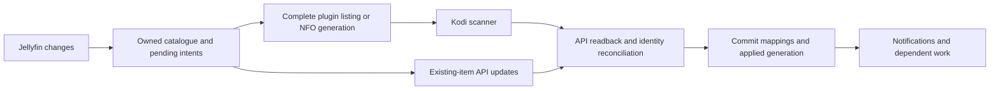

# Kodi API feasibility for an official Kofin variant

Research date: **3 October 2026**

Kofin examined: **0.29.0**, commit `db709a28905ca3b697d7135814407e9476d29361`

Scope: all **49 Python modules, 19,885 Python lines**, and `obj_map.json` under `lib/kofin/sync`, plus the callers that could defeat a database-free migration.

**4 October phase 0 follow-up:** [results and reproducible rig](research/kofin-or/phase0/README.md), [parity ledger](kofin-or-parity.md). Failed empty/partial music enumeration removed existing songs on the tested Piers build. A user-source full tag rescan preserved tracks and imported metadata changes ignored by a normal scan. These strengthen the music reliability gate and §9.1 contribution scope. The existing dirty Flatpak is explicitly accepted for phase 0 until RC1 binaries are distributed; it is not stock qualification.

**Implementation direction agreed on 4 October:** plugin scanning plus JSON-RPC, initially on stock Piers, followed by Kodi v23 with upstream contributions. No NFO/STRM catalogue, Omega support, shared-MySQL requirement or adoption of the existing SQL library. The transition is a fresh-library rebuild. The [phased implementation plan](kofin-or-implementation-plan.md) defines `kofin-or`, development releases from `0.90.0`, the development repository and parallel maintenance; it supersedes this report's earlier implementation choices and phase sketch in §10.

## 1. Conclusions

**An official-repository variant can retain native Kodi video and music library integration without opening Kodi's databases. It requires a different persistence architecture. Replacing each SQL statement with a JSON-RPC call will not work.**

The workable approach is to let **Kodi's scanners create library objects**, use **JSON-RPC to read and update existing objects**, and retain Kofin's own database for server identity, desired state, downloads, and recovery. Python `ListItem`/`InfoTag` objects supply scanner metadata; setting an InfoTag alone does not write the library.

Live tests on P1D established more than the absence or presence of method names:

- A plugin directory supplied native movies, a TV show and episode, music videos, and music tracks. Kodi created their database relationships.
- Most existing metadata, artwork, watched-state, and resume updates have supported paths.
- NFO files alongside STRM files created **one movie with two named native versions, a selected default version, and an extra**. Versions and extras are therefore **not categorically impossible** without SQL.
- Reading an `image://` URL through `xbmcvfs.File` caused Kodi to decode and cache a synthetic image. Ordinary artwork precaching does **not** require direct `Textures` writes.
- Music listing changes removed an omitted song; a subsequent empty listing removed the remaining synthetic music, including its orphaned album and artist.
- JSON-RPC batches were **not atomic**. Refresh could change a movie's Kodi ID. A changed playcount generated an announcement that the existing Kofin listener could echo to Jellyfin.

**Full parity with the current implementation is unavailable through the present public interfaces.** The main gaps are fine-grained version/extra management, episode tags, independent artist/album creation, arbitrary music source membership, some music and season fields, file relocation while preserving identity, and native chapter-thumbnail aliases. Some user-facing outcomes can be retained with redesigned storage or Kofin-provided views; that is different from preserving the same native Kodi state.

### Recommended decision

Proceed with a **separate API-backed persistence implementation**, initially targeting stock Piers. Retain the server sync engine and replace its Kodi-facing backend. Use plugin scanning for video and music, retain extras browsing and provide an addon version chooser using the existing media-source resolver. Close the relevant ingestion gaps through Kodi contributions rather than an NFO/STRM catalogue. Robust music ingestion is a Piers acceptance gate; full native asset functionality is tracked for the later parity decision. See the [implementation plan](kofin-or-implementation-plan.md).

Pursue small Kodi fixes alongside that work, and discuss a larger provider/import API with Kodi maintainers before implementing it. Repository acceptance remains a separate review; no Kodi or Kofin PR was opened during this research.

### Reading guide

1. [Evidence, versions and policy](#2-evidence-versions-and-policy)
2. [Available integration mechanisms](#3-available-integration-mechanisms)
3. [Video metadata and relationships](#4-video-metadata-and-relationships)
4. [Music](#5-music)
5. [Artwork, downloads and presentation](#6-artwork-downloads-and-presentation)
6. [Sync lifecycle and performance](#7-sync-lifecycle-and-performance)
7. [Migration matrix](#8-migration-matrix)
8. [Kodi contribution proposals](#9-kodi-contribution-proposals)
9. [Implementation and verification sequence](#10-implementation-and-verification-sequence)
10. [Code coverage and evidence index](#11-code-coverage-and-evidence-index)

## 2. Evidence, versions and policy

### 2.1 Evidence levels

This report distinguishes:

| Label | Meaning |
|---|---|
| **Observed** | Executed against the P1D Kodi process and checked the result, generally with API readback. |
| **Source** | Established by the public API schema or C++/Python source; not necessarily exercised for every field. |
| **Design** | A proposed adaptation using those capabilities; requires implementation and integration testing. |
| **Gap** | No supported operation found in the inspected public interfaces for the stated behavior. This does not mean a custom UI cannot reproduce its appearance. |

The [evidence directory](research/kodi-api-sync/README.md) contains the synthetic provider, the in-process benchmark, sanitized observations, and a reproduction guide. A few **read-only** database queries were used as research instruments to verify otherwise unexposed results, such as native video asset rows and season plots. They are not proposed for the official addon. **All synthetic library writes used Kodi APIs or scanners.**

### 2.2 Version boundaries

| Component | Examined version | Consequence |
|---|---|---|
| Kofin | `db709a28905ca3b697d7135814407e9476d29361` | Findings describe this code, not every future branch. |
| Local Kodi reference, `../../ref/xbmc` | `d2a58647e5bbe809e7a3db9cf4c90439171a33c1`, branch `test/jobqueue-fix-on-psf` | Useful source reference with local changes; not assumed to equal upstream or the running binary. |
| P1D Flatpak | Kodi **22.0 beta2**, revision **`20260831-e513e0ff-dirty`** | Real execution evidence, but the `dirty` build is not proof of an unmodified release binary. |
| P1D JSON-RPC | **13.200.0** | HTTP introspection exposed 181 methods. |
| Current upstream Piers | `157730c04e5f49aa0607a4afc58373bbd8987571` | Source and schema cross-check for conclusions about upstream. |
| Current upstream master | `d34e66e5c70eed1530fd8a3d26a1873dcbc8125a` | Compared the relevant library method signatures. |

Both upstream schemas contained 184 method definitions. The HTTP introspection differences included transport-dependent methods (`Files.Download`, `JSONRPC.GetConfiguration`, `JSONRPC.SetConfiguration`); they are not evidence of missing library functionality. The relevant methods' parameter-name lists matched the live instance; this comparison does not certify every referenced schema type or implementation detail. Upstream's development API version file reported 13.1000.0. **Capability detection should inspect methods and parameters, not infer support from a minor-version comparison.** See the pinned [method schema][k-methods] and [version file][k-version].

P1D used MyVideos149 and MyMusic84. Existing Kofin gates MyVideos131/146/147/148/149, MyMusic83/84, and Textures13/14. An API backend should remove those Kodi schema gates, while retaining migrations for Kofin's own database. This also removes the assumption that Kodi's library must be a local SQLite file; shared MySQL/MariaDB configurations become a plausible target, although they were not tested here.

**Compatibility is not proven for Omega or earlier Piers builds.** In particular, `VideoLibrary.SetSourceContent` was added by [Kodi PR #28882][k-source-pr], merged on 10 August 2026. Older Kodi builds need user-configured video sources or a deliberately reduced feature set. Piers season-plot ingestion also needs capability/version handling. A current wiki page headed “v13” is not a sufficient specification for this build.

### 2.3 Official repository implications

Kodi's published addon rules prohibit **direct access** to Kodi's databases, including reads, and direct addons to JSON-RPC. They allow addon-owned data in the addon profile. Access elsewhere requires explicit user opt-in or an agreed exception, and addons must not install or modify other addons. Acceptance is at Team Kodi's discretion. Consequently, retaining SQL “only for lookup,” manipulating copied database files, or delegating SQL to a helper would not address the stated requirement. [Official addon rules][k-rules]

Kofin may retain `kofin.db`, its own SQLite transactions, `sync.json`, server DTO snapshots, generated manifests, download records, and migration state in its own profile. The forbidden dependency is the access to **Kodi-owned** tables and files. `Database("video")`, `Database("music")`, `Database("texture")`, and the default `Database()` all need to disappear from the official execution paths. Currently even a purported read through `Database` can execute `PRAGMA journal_mode=WAL`.

The source checkout under `../../ref/xbmc` is a reference for Kodi's implementation; the actual databases are in Kodi's active userdata/database location. That distinction matters when describing what the addon must stop opening.

## 3. Available integration mechanisms

### 3.1 JSON-RPC: substantial updates, no general insertion API

Use `xbmc.executeJSONRPC` inside Kodi. It does not require enabling the webserver, retaining HTTP credentials, or round-tripping through the network. HTTP was useful for external probing; the performance measurements below used the in-process interface. [Python implementation][k-python]

The inspected API has:

- Video getters; setters for movies, sets, TV shows, seasons, episodes, and music videos; removal of movies, TV shows, episodes, and music videos; scans, refreshes, cleaning, and export.
- Audio getters; setters for existing artists, albums, and songs; scans, cleaning, and export.
- File-level video playcount/lastplayed/resume updates.
- Texture enumeration and removal.

It does **not** have general `VideoLibrary.AddMovie`, `AddEpisode`, or corresponding audio insertion methods. `Set*Details` requires an existing Kodi ID; an unknown ID is not an upsert. No general path/file relocation API or transaction API was found. [Public method schema][k-methods]

**Observed:** `VideoLibrary.AddMovie`, `AudioLibrary.RemoveSong`, and `Textures.AddTexture` returned method-not-found. Unsupported `cast`, `file`, or `streamdetails` arguments to movie setters returned invalid-parameters. A valid setter targeting a nonexistent movie returned not-found. These are distinct failure classes and should be handled distinctly.

### 3.2 Plugin directory scanning: a real insertion path

A plugin can declare `medialibraryscanpath` entries for movies, TV shows, and music videos in its manifest, return `ListItem`s with the appropriate media type and metadata, and have Kodi scan those directories. Kodi's [plugin metadata loader][k-plugin-tags] consumes those tags and artwork, while the [video scanner][k-scanner] writes the native library.

Minimal sequence for a Piers movie source:

```json
{
  "jsonrpc": "2.0",
  "id": 1,
  "method": "VideoLibrary.SetSourceContent",
  "params": {
    "path": "plugin://plugin.video.kofin/<movie-library>/",
    "content": "movies",
    "scraperid": "metadata.local",
    "noupdate": false
  }
}
```

Follow with `VideoLibrary.Scan` for that directory, wait for completion, then query the inserted objects and establish the Kofin-to-Kodi mappings. `SetSourceContent` configures content and scraper information. **It does not add a visible source to `sources.xml`, insert movies, or register a music source.** Its `scanrecursive` argument is a boolean, not the database's integer depth. [Source-content implementation][k-vrpc]

**Observed:** the provider created movies with cast, metadata, stream details, artwork, a custom unique ID, watched state, and resume information. It also created a music video. A TV show and episode were imported after explicitly binding the show directory. The initial root-only TV configuration did not import them; an implementation must verify per-show path inheritance rather than assume it.

The provider must distinguish:

- Ordinary browse and playback invocations.
- `kodi_action=refresh_info`: return a directory containing the refreshed metadata item, as expected by `CVideoTagLoaderPlugin`.
- `kodi_action=check_exists`: answer using the plugin's resolved-URL success/failure protocol, as expected by `CPluginDirectory::CheckExists`.

These callbacks should use a **complete, committed local catalogue**. A server timeout is not evidence that an item ceased to exist. Kodi cleaning is compatible with correctly implemented plugin existence callbacks; the existing blanket warning that plugin paths are necessarily incompatible with cleaning is too broad for this architecture. [Plugin directory implementation][k-plugin-directory]

#### URL layout is part of the storage contract

Kodi handles plugin paths specially in `CVideoDatabase::SplitPath`. A file such as `plugin://addon/movies/0.mkv` can be associated with the addon root rather than the expected movie directory. A query-based path such as `plugin://addon/movies/?id=0` retains the directory before the options. This affected source inheritance, refresh, and the scope of cleaning in the live tests. [Video database implementation][k-vdb]

**Observed:** refreshing the path-only fixture with no binding for its actual stored root removed the old movie and failed to recreate it. Binding the root allowed refresh. The query-based fixture worked with the movies directory binding and survived scoped cleaning. Its successful refresh changed its Kodi ID from 2003 to 2005.

For Kofin, retain a stable source namespace per server/library/content type, and use URLs whose grouping has been verified through the API. Existing query-based video URLs are a useful starting point. Remove the need to know `dbid` before creating a URL: make server item identity canonical, then look up the current Kodi ID when necessary. Never rely on a title as the identity key.

### 3.3 NFO/STRM catalogue: additional video capabilities

An addon-owned directory of `.strm` files containing stable Kofin playback URLs, with corresponding `.nfo` metadata, is another supported scanner input. It can be kept under Kofin's profile. No Kodi database access is required. [NFO loading][k-nfo], [NFO tag parsing][k-tag]

This is useful for metadata not fully represented in public setters, and particularly for video versions. The live fixture contained two STRM/NFO pairs with the same custom unique ID, `hasvideoversions`, `isdefaultvideoversion`, and distinct `videoassettitle` values. Kodi imported one movie, two named version assets, and the specified default. An `Extras/` directory supplied a third STRM that became a native extra.

The costs are real:

- Catalogue files must be updated atomically, with complete parent/child snapshots.
- Native library paths refer to STRM files; playback still resolves through Kofin. Library claiming, download handling, playlists, and userdata identity must account for both paths.
- Refresh and rebuild can reallocate IDs; metadata changes are not all detected merely because a listing is scanned again.
- Source settings affect extras ingestion. The P1D test temporarily disabled “ignore video extras” and restored it afterward. The addon should respect the user's choice; a production variant should not silently change a global preference.
- Native asset creation is demonstrated; continuous edit/remove/reorder/default-switch behavior for a large changing collection is not fully validated.

This is a viable bridge, not a claim that every asset operation is now covered. Section 4.5 defines the remaining gaps.

### 3.4 Other possible routes considered

| Route | Assessment |
|---|---|
| Pure plugin browsing with `ListItem`s | Preserves a rich Kofin UI and playback; does not by itself create native library items, native smart-playlist membership, or general skin library widgets. Useful as a fallback. |
| Metadata scraper addon | Supplies metadata to Kodi's scan pipeline. It still needs discoverable items and source configuration; it does not grant arbitrary database CRUD. Kofin already has the metadata, so `metadata.local` plus supplied tags/NFO is simpler. |
| `Files.SetFileDetails` | Can establish/update video file bookkeeping and watched/resume state, but not a movie/episode relationship or its complete metadata. Not an insertion substitute. |
| Video XML library import | Kodi's internal importer can populate the library. The inspected public API/builtins do not provide an unattended `VideoLibrary.Import` or `ImportLibrary(...)` equivalent. The settings action opens UI, and import can replace a show and its episodes. Unsuitable as the regular sync engine. |
| Music XML import | Enriches matched artists/albums and related metadata/history; does not create the missing song catalogue. |
| Builtins or simulated GUI actions | Can invoke scans/cleaning or user-facing workflows. They do not add typed CRUD operations, reliable IDs, atomicity, or unattended error reporting. |
| JSON-RPC batches | Reduce invocation/serialization overhead. They execute separate methods and do not create a database transaction. |
| Binary VFS, inputstream, or PVR addon | Provides a different supported interface for files, playback, or live television. None is a general public video/music library writer. Calling Kodi's private C++ database classes would not make this a stock supported integration. |
| MediaImport work | Relevant architectural precedent: provider identity and imported media are a better abstraction than exposing SQL. The inspected [Montellese fork][k-mediaimport] has MediaImport branches; that interface is not present in the inspected stock Piers/master public API. It cannot be assumed as a deployment dependency. |
| Read-only SQL, a helper service, or a patched local Kodi | Useful research tools or a separate experimental distribution. They do not establish an official variant that works through stock supported interfaces. |

The XML/builtin assessment is based on the [video importer][k-vdb], [music importer][k-mdb], and [library builtins][k-builtins]. Export support must not be mistaken for import support.

### 3.5 Could plugin scanning eventually match the NFO/STRM route?

**For the Kofin functionality examined, no fundamental technical barrier was found.** This is a narrower question than closing every gap between direct SQL and supported Kodi interfaces. Most of the gaps in sections 8–9 also apply to an NFO/STRM implementation.

Both the NFO loader and the plugin loader supply Kodi's native video tag and artwork to the scanner. The relevant differences are what Python can express, how the scanner interprets it, and how it discovers associated assets. Extending those interfaces could provide equivalent ingestion without requiring Kofin to generate NFO/STRM files. This is an architectural assessment, not a commitment from Kodi maintainers. [Plugin loader][k-plugin-tags], [NFO loader][k-nfo], [scanner][k-scanner]

| NFO/STRM advantage or apparent advantage | Comparison with plugin scanning |
|---|---|
| Version declarations, grouping and default selection | Demonstrated through NFO. Python exposes the asset title but lacks the complete version declaration used by that scanner path. Equivalent tag fields and scanner handling could close this difference. |
| Native extras discovered from an `Extras/` directory | Demonstrated with the filesystem fixture. A defined plugin asset/directory relationship could provide equivalent ingestion; this was not demonstrated by the plugin fixture. |
| Stream-metadata authority | NFO streams receive higher provenance priority than plugin-supplied streams. An explicit provider metadata authority policy could close this behavioral difference. It should specify whether playback-derived information may replace the supplied values. |
| Additional NFO stream flags | The inspected NFO parser accepts audio/subtitle flags that the Python stream-detail classes do not expose. These could be exposed in Python. Current Kofin sync does not write those flags, so this is future ingestion parity rather than a demonstrated loss of existing sync behavior. |
| Cast, default provider IDs, episode sort numbering and Piers season plots | These already have Python ingestion methods. Their absence from some JSON-RPC setters is not an NFO-only capability advantage. |

With versions/extras deferred, the research establishes no NFO-only requirement that blocks the plugin-scanning choice. Stream provenance remains a concrete difference to account for. NFO files also offer a persistent filesystem representation readable by other tools; that is an operational property, not a necessary native-sync capability.

Matching these ingestion capabilities does **not** by itself require the larger provider/import architecture proposed in section 9.3. That proposal addresses broader ownership, lifecycle and performance issues which remain relevant to both routes.

## 4. Video metadata and relationships

### 4.1 Ordinary fields

The current writers do much more than insert a title. The public update coverage is nevertheless broad. The following describes existing objects; scanner creation is still required. The exact parameter lists are included in the [capability snapshot](research/kodi-api-sync/capabilities.json). [Video API implementation][k-vrpc]

| Current Kofin data | API-backed treatment | Qualification |
|---|---|---|
| Titles, original titles, movie/show sort titles, plots, outlines, taglines | Appropriate `VideoLibrary.Set*Details`; tags/NFO at creation | Not every field exists on every media type. Use the actual schema, not a shared all-fields payload. |
| Genre, studio, country, director, writer | Scanner tags and supported detail setters | Kodi owns link-table creation and cleanup; Kofin should not allocate person/genre/studio IDs. |
| Year, premiere/air date, runtime, certification, production code, track number | Supported fields on the appropriate type | Normalize date/time formats and seconds versus Jellyfin ticks. Episode ordering has additional gaps below. |
| Movie and TV-show trailers | Scanner tags or corresponding setters | Current Piers/live **does** expose TV-show `trailer`; the local reference checkout alone was misleading here. |
| Cast names, roles, order and thumbnails | `InfoTagVideo.setCast` on scan/refresh, or NFO | No `cast` parameter on the ordinary setters. Refresh/rebuild is heavier and may change IDs. There is no general actor CRUD API. |
| Stream codec, resolution, aspect, duration, audio and subtitle language | Video/audio/subtitle stream detail objects at scan, or NFO | No JSON-RPC `streamdetails` setter. Playback may later revise the metadata. |
| Tags: server tags, library name, favourite movie/show/music-video markers | `tag` list on supported setters; scanner tags | Preserve unrelated user tags when computing an update. Episode tags are an exception. |
| Date added for video items | `dateadded` on movie/show/episode/music-video setters | Reapply canonical server value after a rebuild if required. |
| Artwork including poster, banner, clearlogo, clearart, landscape, discart, fanart and numbered fanart | `art` maps and scanner artwork | Dotted keys are rejected in the storage layer; see section 6. |
| Watch count, last played, resume position and total | Existing detail setters; file-level setter where appropriate | Echo handling and file identity are part of the migration. |

`InfoTagVideo` carries more ingestion fields than JSON-RPC carries update fields. That distinction is essential: an absent setter does not necessarily mean the metadata is impossible to import. Conversely, a getter exposing a field does not prove it is writable. [Python video tag interface][k-infotag]

Stream metadata also has provenance in Piers. The inspected source ranks externally supplied stream details below media-derived details, and Python-supplied streams use the external source. A transcode's observed stream properties may replace the server's original-file description. Preserve the authoritative server streams in Kofin's own catalogue; verify what native widgets should display after playback. No live transcoding/stream-precedence test was performed. [Stream detail definitions][k-streams]

### 4.2 Ratings and provider identifiers

Movie/show/episode `ratings` maps support named ratings, vote counts, and a default rating. This can retain community/critic separation and Kofin's preferred display rating where currently implemented. `uniqueid` maps support multiple providers. **Observed:** updating a named rating/default, adding provider IDs, and removing a non-default ID with null worked.

The semantics are not wholesale dictionary replacement:

- Omitted rating/provider entries remain.
- Null entries can remove ratings and non-default unique IDs.
- An empty map is not “delete everything.”
- The JSON-RPC unique-ID update does not expose the same default-provider selection as `InfoTagVideo.setUniqueID(..., isdefault=True)` / `setUniqueIDs`. Seed that through scanning; changing the default later may require a refresh.
- Music videos have a smaller rating surface than movies, shows and episodes; do not send the same ratings payload everywhere.

The backend needs field-aware diffs and a policy for user edits. A custom video unique-ID provider can assist reconciliation, but must be namespaced by server/account as appropriate. Provider IDs such as IMDb identify a work, not necessarily one Jellyfin library item or source. [Update semantics][k-vrpc]

### 4.3 Shows, seasons, episodes and merged identity

**Observed:** `InfoTagVideo.addSeason(number, name, plot)` supplied both a named populated season and a named empty season with plots on Piers. Read-only verification found the season records and plots. `VideoLibrary.GetSeasons` returned the populated season and did not expose a `plot` field. `SetSeasonDetails` accepted only ID, title, artwork and user rating; a `plot` argument was rejected.

Consequences:

- Season names and artwork can be maintained for addressable seasons.
- Season plots can be seeded through show metadata. An in-place JSON-RPC season-plot update/readback is unavailable. Refreshing a show to change them has a much larger scope.
- Empty/virtual season existence is partly supported at ingestion, but equivalent native visibility and reliable public ID lookup cannot be promised.
- There is no general AddSeason/RemoveSeason API. Deleting contained episodes and allowing native cleanup can approximate ordinary pruning, but not all independent empty-season lifecycle operations.
- Episode `season` and `episode` setters exist. Display/sort season and episode values can be supplied through InfoTags/NFO, but lack equivalent public setters.
- Episode parent-show reassignment and arbitrary show/path link management are not exposed as generic operations.

Kofin currently pools or aliases shows by provider identity, heals missing parents, and shares native show/season mappings across Jellyfin entries. Those policies can remain in its own catalogue, but Kodi's scanner has its own matching rules. Emit a deliberate hierarchy, include stable provider identity, reconcile the actual result, and reference-count shared parents before deleting anything. Identical titles, conflicting provider IDs, two servers, and one show spread over multiple libraries all need explicit migration tests. [TV writer](../lib/kofin/sync/writers/tvshows.py), [scanner][k-scanner], [tag interface][k-infotag]

**Episode favourites are a hard native gap.** Kofin stamps `Favorite episodes` through `tag_link`. `SetEpisodeDetails` has no `tag` argument, and the scanner did not persist the synthetic episode's `InfoTagVideo.setTags` value. A Kofin-owned favourites node/listing can preserve the user action and results; native episode-tag smart-playlist parity needs Kodi changes. Kodi's global `Favourites` API represents a different feature and does not substitute for per-episode tag relationships.

The extra file/bookmark records currently created for widget resume should not be copied mechanically. Use a stable playback URL and reconcile native library identity. `Files.SetFileDetails` may help maintain video resume for a known alternate file URL, but it does not reproduce Kofin's private relationships, and widget-to-player identity needs an actual playback test.

### 4.4 Collections / movie sets

**Observed:** assigning a new `set` name through `SetMovieDetails` created a native set. `SetMovieSetDetails` can then maintain its title, plot and artwork. Removing a movie's set assignment and assigning another set are supported; Kodi still has a single native set relationship per movie. [Video API][k-vrpc]

Kofin's collection membership reconciliation, incomplete-response protection, and cached set state can remain. Replace raw count/link reads with API results and the owned catalogue. Existing empty-set creation and precise orphan-set deletion have no corresponding general AddSet/RemoveSet methods. Do not create dummy movies to manufacture empty collections. Represent empty/multi-membership collections in Kofin views where native set semantics cannot represent them.

Set names are not globally safe ownership identifiers. Two libraries can use the same collection name, and a user can have an existing set with that name. Preserve an explicit membership/ownership policy and avoid deleting or renaming shared native objects solely because a Kofin mapping points at them.

### 4.5 Movie versions and extras

The existing movie writer manages multiple `MediaSources`, labels, default/native assets, special-feature extras, artwork and stream rows, asset deletion, and orphan version-type cleanup. [Movie writer](../lib/kofin/sync/writers/movies.py), [movie database adapter](../lib/kofin/sync/kodidb/movies.py)

There are three different retention levels:

| Level | Feasibility |
|---|---|
| Kofin playback chooser / special-features directory | Can remain with plugin UI and owned server metadata, even if only one native movie exists. Native version/extra menus are not preserved by this alone. |
| Native assets generated by a catalogue scan | **Observed for NFO/STRM:** two named versions, correct default, one extra under one movie. Current scanner source explicitly handles these NFO fields and the extras folder. |
| Fully incremental native asset management | **Gap:** no dedicated public enumerate/add/update/remove/default-version API with asset identity, metadata and lifecycle guarantees. Ordinary `GetMovies` focuses on the default movie representation; it is not an asset-management API. |

Python exposes `setVideoAssetTitle`, but does not expose all the version-state flags used by the NFO/scanner path. A label setter alone is not a complete multi-version ingestion protocol. Native GUI version management and automatic duplicate/edition matching also exist, but are driven by matching rules and user settings, not an idempotent server-ID upsert contract. [InfoTag interface][k-infotag], [scanner version handling][k-scanner]

A catalogue backend could regenerate an entire owned movie and its assets, then restore userdata and reconcile IDs. This is a **design option**, not a proven lossless replacement for the current per-asset writer. In particular, test individual version removal, default changes, artwork for non-default versions/extras, bookmarks on all versions, collection membership, and concurrent playback. `Files.SetFileDetails` addresses known video files, which may help with per-STRM state, but cannot set every asset-specific field.

The extras scanner derives labels from filenames, and optional media extraction differs from receiving the full Jellyfin extra DTO. The current typed ExtraType labels and rich asset state are not demonstrated as equivalent. Exact deletion of orphan version-type rows is Kodi housekeeping and should cease to be Kofin's responsibility.

## 5. Music

### 5.1 Native music creation is possible

It would be incorrect to conclude that the absence of `AudioLibrary.AddSong` makes native music sync impossible.

**Observed:** `AudioLibrary.Scan` of a plugin directory imported two synthetic plugin-URL tracks and created their album and artist, without reading actual media bytes for tag extraction. The [music scanner][k-music-scanner] accepts directory listings with already-loaded music tags.

There is a sharp Python interface detail:

1. Modern `getMusicInfoTag().setTitle/setArtist/setAlbum/...` calls alone did **not** cause the synthetic tracks to import.
2. Adding `ListItem.setInfo("music", {"title": title})` caused import, because the legacy implementation marks the tag loaded.
3. A follow-up test used modern setters plus **`ListItem.setInfo("music", {"size": 1024})`**. Both tracks imported. `size` goes through the non-deprecated branch, which also marks the tag loaded.

This is an available bridge, but its loaded-state side effect is not a clean provider contract. Use a meaningful size value if using this approach; an empty `setInfo` dictionary does not enter the loop and does not mark the tag loaded. An explicit supported way to declare complete provider metadata would be preferable. [ListItem implementation][k-listitem], [music scanner][k-music-scanner]

The current scanner also attempts file tag loading during a forced full tag rescan, even for preloaded items. Plugin paths must be validated under that mode; the successful normal-scan experiment does not prove forced-rescan behavior. This is a good upstream test/fix target.

### 5.2 Music updates and identity

| Entity / data | Supported route | Important limit |
|---|---|---|
| Songs, albums, artists associated with tracks | Scan a complete tagged track listing | Kodi decides grouping and identity. There is no independent insertion API. |
| Artist name, biography, genre, instruments, styles, moods, dates, years active, MBID, sort name, type/gender/disambiguation, art | `AudioLibrary.SetArtistDetails` | Existing artist only. Rename/matching effects on shared credits require reconciliation. |
| Album title, credited artists/MBIDs, review, genre, themes, moods, styles, type, label, ratings/votes, release dates, box-set flag, art | `AudioLibrary.SetAlbumDetails` | Existing album only. Some album bookkeeping/derived values are not writable. |
| Song title, artist credits/MBIDs, genre, year, rating, track/disc, duration, comment, MB track ID, playcount, last played, display/sort artist, mood, disc title, BPM, art | `AudioLibrary.SetSongDetails` | No file/path, album ID, or date-added setter; arbitrary performer/contributor relationships are not all exposed. |
| Album duration, exact date-added/last-scraped values, scan-version markers | Let Kodi derive/maintain them, or retain canonical values in Kofin | Exact current SQL values cannot all be imposed by public setters. |
| Independent empty artist/album objects and singles shells | Model in Kofin; let scanning create native album/artist structures around actual songs | Cannot guarantee the same standalone rows and IDs as direct insertion. |
| Discography for existing artists | Native scraping/NFO/import mechanisms can carry some of this | No JSON-RPC discography setter; current bespoke artist/album discography reconciliation is not directly portable. |

The schemas and implementations must both be checked. For example, the current Piers schema exposes song `releasedate`, while `SetSongDetails` checks `albumreleasedate` in the implementation. That is a **source-identified mismatch**, not a live-verified successful field update. It warrants a narrow Kodi fix and regression test; do not advertise release-date setter parity on schema presence alone. [Audio API][k-arpc], [schema][k-methods]

Preserve genuine MusicBrainz IDs and ordered artist credits. Do not encode Jellyfin IDs as fake MBIDs to force uniqueness. Album grouping by native tags/MBIDs may differ from Jellyfin grouping, especially for compilations, same-title albums, singles without albums, duplicate releases, and missing artist records. Maintain server IDs and canonical URLs in Kofin's own mapping and verify the returned song/album/artist associations.

Kofin's existing `relink_content`, fallback artists, recrediting, and orphan healing address real problems. Their **intent** survives; the native operations become complete rescans or supported artist/album/song credit updates. The official backend should not recreate internal role seeds or alter `versiontagscan` to suppress Kodi behavior. [Music writer](../lib/kofin/sync/writers/music.py), [music adapter](../lib/kofin/sync/kodidb/music.py)

### 5.3 Watched state and dates differ from video ingestion

**Observed:** initial music tags supplied playcount 3 and a last-played date, but imported songs read back playcount 0 and no last-played value. `SetSongDetails` subsequently set the desired state successfully. The normal catalogue importer should therefore apply song userdata **after identifying the imported song**, rather than assume initial tags establish it.

The existing song userdata writer stores playcount, last played, and rating 0. It does not implement a native song favourite-tag system or video-style resume merely because its docstring mentions those fields. An API replacement should preserve what the code actually does, and treat any expanded music resume/favourite model as separate work.

Video import of watched/resume values depends on advanced settings. The inspected Piers defaults enable both, and the video probe retained them. Users may override those defaults. Applying server userdata explicitly after scan avoids making sync correctness depend on the import preferences. [Advanced-settings defaults][k-advanced]

### 5.4 Deletion and complete-directory rescans

No `AudioLibrary.RemoveSong`, `RemoveAlbum`, or `RemoveArtist` is exposed. `AudioLibrary.Clean` is library-wide; it has no directory parameter in the inspected schema. It is not a scoped “remove this Jellyfin library” method. [Schema][k-methods]

There is a usable scanner-based deletion path:

- The music scanner removes the old songs for a changed directory and imports its current listing, reconciling existing state.
- **Observed:** changing the synthetic listing from two tracks to one removed the omitted track while retaining the other track's Kodi ID and previously set playcount.
- **Observed during cleanup:** scanning empty owned directories removed all synthetic tracks and the resulting orphaned albums and artist.

The consequence is fundamental: a music scan input must be a **complete snapshot of a directory**, not the page of changes currently being processed by the sync worker. Keep directories reasonably small—an album is a natural candidate—and stage a complete generation before asking Kodi to scan it. Deleting one song requires serving the remaining songs correctly.

`RetrieveMusicInfo` removes old songs before processing the incoming tags. Partial listings, broken tag loading, or interruption therefore deserve recovery tests. Own-database transactions cannot roll back Kodi's scanner. Do not return an empty list on a transient server error. [Music scanner][k-music-scanner]

The listing hash also matters: paths, sizes and dates are inputs, while an arbitrary changed in-memory plot/credit is not necessarily a hash change. Use direct setters for supported updates, and a defined invalidation strategy for metadata requiring rescan. Do not pretend that a normal scan is a forced metadata refresh.

### 5.5 Music source membership and per-library nodes

`musicsources.py` creates a MyMusic source per Jellyfin library and explicitly associates albums with it. It then reasserts those records because Kodi's source reconciliation can remove database-only sources. There is no equivalent public API to create these arbitrary source/album associations. `AudioLibrary.GetSources` and `Files.GetSources` are getters. `VideoLibrary.SetSourceContent` does not solve this. [Current source adapter](../lib/kofin/sync/musicsources.py), [music database][k-mdb]

**Observed:** scanning the unregistered plugin music directory created tracks but no source/album links for the probe.

Possible adaptations:

1. Have the user register actual music sources through Kodi and allow the scanner to assign source membership naturally. This requires a supported setup flow and testing with plugin sources.
2. Use stable per-library plugin paths and path-based selection where the native query supports it. This works better if downloads no longer relocate the library path.
3. Produce Kofin-owned per-library artist/album/song listings from the private catalogue. These can preserve browsing results, but are not the same as arbitrary native source-filter smart playlists.
4. Propose a supported source registration/ownership interface upstream.

Generating or editing `sources.xml` is not an API replacement and introduces outside-profile access and reload/concurrency issues. It should not be the default architecture. Downloaded-music membership cannot simply keep using the current “local path means downloaded” rules once stable resolver paths replace repointing.

## 6. Artwork, downloads and presentation

### 6.1 Artwork association and caching

Preserve `fields.py`'s Jellyfin artwork selection and `kodidb/artwork.py`'s media-to-art-type mapping. Deliver those URLs through scanner items or `Set*Details(art=...)`. Explicit null values remove selected art types; omitted keys remain. An empty map does not clear existing artwork. Native normalization can return an `image://` wrapper around the original URL, so comparisons should normalize values rather than repeatedly rewrite an equivalent URL. [Video artwork updates][k-vrpc], [audio artwork updates][k-arpc]

**Observed limitation:** `art={"kofin.downloaded": ...}` returned success but did not store the badge, both via scanning and a detail setter. The native video and music storage code excludes art keys containing a dot. A non-dotted `kofindownloaded` key worked. Preserve the badge feature by changing the key and its skin/node consumers, or by supplying a ListItem property in Kofin views. Exact `ListItem.Art(kofin.downloaded)` compatibility needs a coordinated change or a Kodi feature discussion. Dots also carry inheritance meaning in artwork access, so simply removing the restriction upstream needs careful design. [Video storage][k-vdb], [music storage][k-mdb]

Ordinary texture-cache population has a supported route:

```python
from urllib.parse import quote
import xbmcvfs

# Run away from a latency-sensitive UI callback.
handle = xbmcvfs.File("image://" + quote(art_url, safe="") + "/")
try:
    handle.readBytes(1)
finally:
    handle.close()
```

Opening the image VFS file invokes Kodi's cache machinery; the read is not a write to the database by the addon. The live probe read the complete tiny image, received 223 cached-image bytes, and `Textures.GetTextures` subsequently returned a 2×2 cache entry. Cache key spelling is Kodi's responsibility. [Image VFS implementation][k-image-file]

Therefore `service/artcache.py` can retain bounded precaching, cancellation, server URL selection, and progress reporting while replacing actor SQL queries with server DTOs or API `cast` properties and replacing manual thumbnail/texture insertion with Kodi's image VFS. Use `Textures.GetTextures` with a narrow URL filter and `Textures.RemoveTexture` to invalidate owned stale entries. Do not rewrite CRC filenames, texture dimensions, or usage counters.

A remaining tradeoff is authenticated/offline artwork. Kofin can download an image into its own profile and reference that file as art. That preserves offline display, but changes the art URL and requires normal cache invalidation. Warming a URL does not establish an arbitrary alias from a different cache key to supplied bytes.

### 6.2 Chapter images

`service/chapters.py` seeds server-provided JPEGs into the cache under the special keys that Kodi's native bookmarks dialog constructs for chapters of the **playing video**. That is more than ordinary artwork caching. The native dialog derives those keys from the player path and chapter number, rather than looking up Kofin's server artwork URL. [Current chapter service](../lib/kofin/service/chapters.py), [native bookmark dialog][k-bookmarks]

No public texture insertion/alias method or Python chapter-art attachment interface was found that preserves that behavior. Opening the native chapter `image://video@...` URL asks Kodi to extract its own thumbnail; it does not install the server's chapter image at that key.

Options are to retain a Kofin-owned chapter chooser with server images, let Kodi extract native thumbnails, or add a supported chapter-art provider API upstream. **Exact server-image seeding into the native chapter dialog is a gap.** A generic image precache API alone would not fix it.

### 6.3 Downloads and file repointing

Today `kodidb/downloads.py` and `downloads/repoint.py` alter the native file/song location, update episode path columns, create download-related paths, and maintain badges/tags. There is no public setter for the corresponding movie/episode/song file path. `Files.SetFileDetails` changes video userdata, not the path of an existing library object. **Observed:** a song `file` setter parameter was rejected; file-level music state was also outside that method's supported media type. [File operations][k-files]

**Recommended design:** make the native library URL stable and resolve it to the local download when available, otherwise to the server stream. Kofin already controls plugin playback and has a private download store. This preserves offline playback, download subscriptions, and native identity without repointing Kodi's tables.

Changes required:

- Resolve the owned download before requiring a live server connection.
- Maintain correct native library identity through `setResolvedUrl`, playback monitoring, resume, and completion reporting.
- Keep download state in the owned store and apply supported tags/art where applicable.
- Rework downloaded-music and downloaded-episode views that currently infer membership from filesystem paths.
- Preserve parent show/season download badges using known relationships and supported art, with the dotted-key migration above.
- Choose an API-compatible replacement for the direct HTTP music-path mode when local-download substitution is required. A fixed direct HTTP URL cannot be transparently redirected by a plugin resolver that is never invoked.

Removing an item and rescanning it at a new location is an alternative, but may change IDs, timestamps, links and bookmarks. It should not be the routine download transition. Likewise, a local HTTP redirect service is possible in principle but adds lifecycle and availability dependencies that a stable plugin URL avoids.

The scanner tests did not exercise actual downloaded playback, gapless music, seeking, widget playback, subtitle selection, or disconnect/reconnect. Those are implementation gates, not proof that the design has already preserved every playback behavior.

### 6.4 Playlists, nodes, favourites and UI refresh

`playlists.py` can retain ordered M3U8 playlists, duplicates, unresolvable-item policy, checksums, naming, and cleanup. Replace SQL song/file lookups with the owned mapping and API results. Kodi's `Playlist.*` interface manages playback queues; it does not replace persistent ordered Jellyfin playlist manifests. Keep generated manifests under the addon profile, or use an explicit user-selected destination.

Video library nodes can continue to select supported tags and native media. Music nodes need the source-membership redesign above. Kofin-owned plugin listings can preserve rich per-library, favourites, downloads and empty-collection views when native filter fields are unavailable. This does not automatically provide the same third-party skin widgets or smart-playlist compatibility.

`nodes/*`, `views.py`, and `kodisetup.py` currently write into the profile-wide library/playlists directories, and seed Kodi's default node trees. Installing those integrations needs a deliberate opt-in flow with an ownership manifest and narrow removal. Detecting user advanced settings by reading their file also needs to be considered in that outside-profile access policy. Avoid a blanket “sync enabled” consent that hides unrelated file access. [Node setup](../lib/kofin/sync/kodisetup.py), [node filesystem helpers](../lib/kofin/sync/nodes/fs.py)

The current refresh system exists partly because direct SQL bypasses Kodi notifications. Its no-op video scan, fake music probe, SQL fingerprints and content-visibility repairs are not the right baseline for an API backend. Scans and setters already run through Kodi's update machinery. Use scan completion, library announcements where emitted, owned generation numbers, and targeted container refresh; retain narrowly justified skin workarounds only after observing them with the new backend. Do not use frequent global scans as a widget-refresh signal once scans actually import content. [Refresh policy](../lib/kofin/sync/refresh.py), [widget fingerprints](../lib/kofin/sync/widgetstate.py)

### 6.5 Official-variant work outside `sync`

Restricting the change to `/lib/kofin/sync` would leave important incompatible behavior reachable elsewhere:

| Area | Required follow-through |
|---|---|
| `service/artcache.py`, `service/chapters.py`, `core/imagecache.py` | Remove Kodi texture/thumbnail writes; use the distinct ordinary-art and chapter strategies above. |
| `downloads/repoint.py`, relevant branches in `downloads/manager.py` and callers | Remove Kodi location writes and SQL verification; adopt stable resolution and API readback. |
| `service/libraryclaim.py` | Replace native filename SQL checks with public library identity checks or a verified owned mapping. |
| `service/kodiuserdata.py` and player/reporting consumers | Handle API-generated userdata announcements and IDs that change after refresh. |
| `plugin/actions.py`, remote-control and playlist consumers | Audit all invoked repair/reset paths and assumptions about native IDs. Their use of **Kofin's own** mapping database is allowed; it should not be indiscriminately removed. |
| `core/addonxml.py`, `service/settings_apply.py` | Current runtime rewriting of the installed manifest's `reuselanguageinvoker` flag needs a different packaging/settings approach or a specifically agreed policy. |
| `service/backdrop.py`, `plugin/browse.py` | The service overwrites installed `resources/media/fanart.webp`. Use owned dynamic images for controllable UI; a fixed installed addon metadata fanart reference does not become dynamic just by moving the file. |
| Packaging and dependencies | Review optional/private dependencies, installation flows, licences, localization and supported Kodi/Python versions as part of submission. This research is not a complete licensing or repository acceptance audit. |

An official build should make native-database backends unreachable, preferably absent from its shipped persistence layer. Leaving a user-selectable “fast SQL mode” in the official variant does not meet the stated objective.

## 7. Sync lifecycle and performance

### 7.1 What can remain

Most of the synchronization policy is independent of SQLite:

- Jellyfin requests, pagination, metadata transforms, timezone/tick conversion and artwork selection.
- Desired library whitelist, server/library identity, view ordering, etags and change-feed watermarks.
- Feed gap detection, incomplete-result protection, full reconciliation, retries and backoff.
- Download subscriptions, notification grouping, watched-item suppression and playlist snapshots.
- Private mappings, restore-point fingerprints/expiry, and private database migrations.

`library.py`, `full_sync.py`, `workers.py`, `changefeed.py`, `downloader.py`, `prune.py` and the hooks can retain those policies, but their success/commit boundary must change. A scanner accepting a request is not a writer committing a page.

### 7.2 A replacement write lifecycle



1. Persist the desired item and a pending operation in Kofin's database.
2. Stage a complete, immutable generation for any directory that Kodi will scan.
3. Serialize relevant scan/refresh jobs and handle an already-running Kodi scan. Do not assume two scan calls queue two independent jobs.
4. Detect actual completion using monitor events/conditions plus bounded readback; a successful RPC reply usually acknowledges scheduling.
5. Resolve native identity by owned URL/custom video identity and verify type/parent relationships.
6. Apply supported metadata/userdata patches, inspect **every** response, and confirm important state.
7. Commit the applied generation, current native IDs, and dependent mappings in Kofin's own transaction.
8. Emit new-content notifications and trigger download subscriptions only after confirmed application.

If Kodi exits halfway through, replay pending intents idempotently. On restart, an old native ID is a hint, not proof of ownership. A recycled ID must never make Kofin modify an unrelated user's item. Shared show/set/artist relationships also require ownership/reference checks.

The existing code does not provide a globally atomic transaction across all databases either, but it does rely on page/item rollback within an open Kodi connection. JSON-RPC does not preserve that boundary. The backend must make partial success a normal recoverable state instead of marking a page successful because the transport returned JSON.

### 7.3 Notifications and userdata echo

**Observed in process:** changing synthetic movie playcount from 3 to 9, with resume from 12 to 56 seconds, produced a `VideoLibrary.OnUpdate` announcement with sender `xbmc` and nested `item` plus `playcount`. The same monitor saw no additional such announcements for 900 plot-only updates. Do not generalize that every setter emits the same announcement, or that setters emit none.

The current Kofin listener can interpret an API-applied server state as a new Kodi user edit and write it back to Jellyfin. Design a bounded expected-state ledger keyed by server item, Kodi identity, field values and generation. Record intent before issuing the API call; suppress matching acknowledgements while still allowing genuinely different concurrent user changes. Normalize playcount/resume rounding and deletion/reset semantics. Merely ignoring every sender named `xbmc` would also ignore real user actions.

Kofin-originated resets/removals and scanner churn can likewise trigger observers. Do not advance server watermarks or report playback merely because a metadata scan generated a library event. [Existing userdata listener](../lib/kofin/service/kodiuserdata.py), [video API implementation][k-vrpc]

### 7.4 Measured API cost

The benchmark used `xbmc.executeJSONRPC` in P1D's Python runtime. Each sample changed the plots of **100 synthetic movies**, in a library containing roughly 1,800 other movies. Each mode was measured three times.

| Invocation mode | Sample times for 100 updates, seconds | Median |
|---|---|---:|
| 100 individual calls | 0.3073, 0.2949, 0.1907 | **0.2949 s** |
| Four batches of 25 | 0.1867, 0.2491, 0.1813 | **0.1867 s** |
| One batch of 100 | 0.1885, 0.2569, 0.2095 | **0.2095 s** |

All responses succeeded. A separate plugin scan growing two synthetic movies to 100 completed in **0.6592 seconds**, including polling overhead. This included 98 new items and the scan's treatment of the two existing items. [Recorded performance and batch observations](research/kodi-api-sync/observations.json)

These numbers establish that in-process API overhead is not automatically prohibitive. They do **not** establish production parity with direct SQL:

- No matching direct-SQL baseline was run.
- The metadata setter benchmark changed one field per movie; it did not rebuild a complete real library with large casts, artwork downloads, episodes, versions or music relationships.
- The small scan used synthetic metadata and local/default artwork, with no Jellyfin fetch cost.
- Caches were warm, order was fixed, and three samples do not isolate noise.
- This was one desktop Flatpak instance with a modified build, not an Android/ARM or shared-MySQL benchmark.
- Per-method database work and GUI invalidation remain even when requests are batched.

Batching 25 happened to beat batching 100 here; this is not evidence for a universal optimal batch size. Measure responsiveness and cancellation alongside throughput. Avoid importing HTTP round-trip latency into the in-process design.

### 7.5 Batches, concurrency and performance improvements

**Observed:** a three-element batch returned success, missing-ID error, success. Both successful changes persisted. Kodi's [JSON-RPC dispatcher][k-jsonrpc] processes the batch's requests individually; it does not wrap them in one outer transaction.

Practical optimizations available now:

- Preserve etag/diff skipping and only send changed fields.
- Read paginated IDs and the smallest needed property sets; avoid one getter per field.
- Batch independent updates with unique request IDs and inspect each response.
- Scan complete bounded directories from local snapshots, not live remote paginated responses.
- Avoid refreshing whole shows when a setter can update the changed field.
- Keep artwork work bounded and separate from library identity reconciliation.
- Coalesce repeated server events for the same item while retaining userdata ordering.
- Let Kodi perform native entity/link cleanup rather than duplicating SQL maintenance.

A high-value performance PR would expose an owned import/update job with bulk operations, explicit outcomes and coalesced notifications. A JSON array by itself is not such an interface. More concurrent API writer threads are not a substitute for reducing repeated native work.

### 7.6 Removal, clean, reset and repair

Video items can be removed through the matching `Remove*` methods. Piers `SetSourceContent(content="none", clearmode="remove")` can remove content associated with a source. Scope and ownership must be established first, including nested paths and shared shows. A source exclusion or scraper clear is not the same as removal. [Source clearing][k-vrpc]

`VideoLibrary.Clean` removes things Kodi considers missing; it is not “remove all items belonging to this server.” The path-only plugin probe also demonstrated why a requested clean directory may not match the directory stored for a file. Prefer explicit video item removal when ownership is known, and a correct existence protocol when using cleaning.

Music removal uses complete-directory rescans as described above. Do not invoke global `AudioLibrary.Clean` merely to delete an owned playlist or library.

`clean.py` currently wipes and reseeds Kodi tables, including the possibility of removing unrelated native content. **There is no equivalent public reset-to-pristine-database operation.** An official Kofin reset should remove verified owned items and owned files, clear private sync state, and leave database compaction, seed rows, orphan housekeeping and other users' library content to Kodi. It cannot promise identical row IDs, row counts in internal tables, or byte-for-byte fresh databases. [Current reset implementation](../lib/kofin/sync/clean.py)

Repair can still re-fetch, reconcile and reimport Kofin's content. Its UI must describe the scope accurately. Internal trigger repair, schema patching, copying entire Kodi databases, and arbitrary path-table sweeps are not part of the official backend.

## 8. Migration matrix

**Keep** means the user-facing behavior has a supported route. **Rework** means it can substantially survive with changed persistence/semantics. **Partial** identifies a native limitation. **Gap** means the stated exact behavior requires Kodi changes or must be omitted. “Keep” does not mean the existing writer code can remain unchanged.

| Current sync functionality | Verdict | Official-variant route / remaining difference |
|---|---|---|
| Server fetches, pagination, field transforms | Keep | Existing pure/network code. |
| Whitelists, checksums, feed watermarks, repair guards | Keep | Owned store; update the application-success boundary. |
| Native movie creation | Rework | Plugin scan or NFO/STRM catalogue. Observed. |
| Native show and episode creation | Rework | Typed hierarchy, correct source binding, scanner ingestion. Observed. |
| Native music-video creation | Rework | Plugin scan; observed. |
| Native song/album/artist population | Rework | Complete tagged music directory scans; observed, with loaded-tag bridge. |
| Common scalar metadata | Keep | Type-specific detail setters after creation. |
| Cast/roles/order/actor thumbs | Rework | Scanner/refresh tags or NFO; no direct cast update API. |
| Video/audio/subtitle stream metadata | Rework | Scanner/refresh metadata; no stream-detail setter, provenance caveat. |
| Video provider IDs and named ratings | Keep / partial | Map updates work; default unique-ID selection requires ingestion/refresh. |
| Video date added | Keep | Explicit setter exists. |
| Exact music date added and scan/scrape bookkeeping | Partial | Native-derived or owned metadata; not all fields publicly writable. |
| Movie/show/music-video favourites via tags | Keep | Supported tag lists, preserving unrelated tags. |
| Episode favourites via native tags | Gap | Kofin listing fallback; native tag persistence needs Kodi changes. |
| Video playcount/lastplayed/resume | Keep | Detail/file setters; fix echo and identity handling. |
| Song playcount/lastplayed/rating | Keep | Post-scan `SetSongDetails`; initial scan did not preserve supplied state. |
| Season title and art | Keep / partial | Setters for known seasons; empty season lookup/visibility incomplete. |
| Season plot | Partial | Piers ingestion works; no normal API getter/setter. |
| Display/sort episode numbering | Partial | Initial InfoTag/NFO fields; no equivalent detail setter. |
| Explicit show/season pooling and aliases | Rework | Owned mapping plus scanner matching and shared-parent checks. |
| Parentless/missing-parent healing | Rework | Stage valid hierarchy, rescan and reconcile returned IDs. |
| Collection membership and set metadata | Keep | Movie `set` assignment plus set detail updates. |
| Independent empty sets / precise set deletion | Gap | Kofin-owned collection views or upstream methods. |
| Native movie versions/default and extras at creation | Partial | NFO/STRM path observed; settings and catalogue required. |
| Incremental per-version/extra editing/deletion/state | Partial / gap | Whole-movie rebuild is an unproven workaround; dedicated API preferable. |
| Version selection and special-feature playback | Rework | Retain the media-source resolver and extras browser; add an addon version chooser, without claiming native-menu parity. |
| Independent empty artists/albums and singles shells | Partial | Native scanner creates song-backed structure; own views retain other objects. |
| Artist credit corrections and fallback artists | Rework | Public credit updates/complete rescans; native matching governs IDs. |
| Exact discography and role-row maintenance | Partial / gap | Some scraper/NFO enrichment possible; no equivalent direct relationship API. |
| Synthetic native music source/album links | Gap | User-registered sources, alternative views, or new Kodi interface. |
| Music library browsing by server/library | Rework | Stable paths or owned catalogue views; arbitrary native source filters not assured. |
| Movie/show/episode/music artwork | Keep | Scanner art plus setters; URL normalization/null semantics. |
| Actor artwork precaching | Rework | DTO/API discovery plus image VFS; observed caching route. |
| Manual texture rows/CRC/dimensions/usage counters | Retire | Kodi owns its cache. |
| Server chapter images in native bookmarks dialog | Gap | Chapter-art API needed; own chooser remains possible. |
| Download playback and subscriptions | Rework | Stable resolver chooses local media from own download store. |
| In-place native file/song relocation | Gap | No supported file setter; avoid relocation or rebuild. |
| Download badge with exact dotted art key | Gap as-is | Rename to a non-dotted key and update consumers; observed alternative works. |
| Download parent badges and supported video tags | Rework | Known parent IDs plus supported art/tag setters. |
| Downloaded-music/path-driven views | Rework | Own membership views; stable plugin path no longer signals local download. |
| Ordered playlists and duplicate entries | Keep | Owned M3U8/playlist snapshots; API/owned lookup replaces SQL. |
| Global native nodes/playlists installation | Rework | Explicit opt-in, ownership tracking and narrow cleanup. |
| Content notifications and refresh coalescing | Keep / rework | Notify after confirmed apply; replace SQL/no-op-scan assumptions. |
| Widget SQL fingerprints | Retire / rework | Owned generations and API/monitor readback. |
| Page transaction/rollback over Kodi writes | Gap | Recoverable pending intents and per-operation results. |
| Schema-number gates, seeding and internal migrations | Retire for Kodi | Probe public capabilities; keep owned schema migration. |
| Library removal / repair | Rework | Owned video deletion and music snapshots; verify cascades. |
| Wipe/reseed all Kodi databases to pristine | Gap / omit | Offer an owned-content reset instead. |

## 9. Kodi contribution proposals

These are concrete proposal scopes, not claims that maintainers will accept them or that no related issue exists. The current Piers/master source and schemas were checked to avoid proposing already-available methods. Public search is not a complete duplicate-issue audit; recheck the tracker when preparing each PR. In particular, **do not propose adding `VideoLibrary.SetSourceContent`: #28882 already delivered it.**

### 9.1 Small, well-bounded fixes first

| Priority | Proposal | Concrete acceptance evidence |
|---|---|---|
| High | **Give plugin music metadata an explicit loaded/complete contract**, and define forced-rescan behavior for provider listings. | Modern InfoTag-only synthetic directory imports correctly; no reliance on legacy `setInfo` side effects; normal and forced scans retain valid provider tracks; malformed/failed listings do not silently erase the old snapshot. |
| High | **Fix song `releasedate` schema/implementation mismatch.** | A `SetSongDetails(releasedate=...)` call changes the value returned by `GetSongDetails`; invalid/clearing values have specified behavior. The present mismatch was source-identified. |
| Medium | **Expose season plot in get/set schemas and implementation.** | Set/read round trip for a populated season, refresh preservation, and a specified behavior for empty seasons. Piers already has the underlying plot and ingestion support. |
| Medium | **Persist and expose episode tags consistently.** | Python/NFO scan and JSON setter/getter round trips; tag-based episode query/smart-playlist behavior; removal cleans links without affecting other media. Schema-only changes are insufficient. |
| Medium | **Improve scanner/refresh completion reporting.** | An API client can distinguish queued, running, failed and completed jobs and obtain resulting item identities without guessing from an immediate `OK`. |

These fixes directly address reproducible failures or clear interface gaps. They can be reviewed independently of a new importer architecture.

### 9.2 Native video assets

Propose a typed asset surface for listing versions/extras, adding/removing an owned file, assigning a label/type, updating artwork/streams, and selecting the default version. Define identity in terms of an asset handle and owning movie, not raw table IDs or enum integers leaked from a schema. Include userdata behavior and deletion cascades.

Tests should cover two versions sharing a movie, two movies sharing a label, default removal/replacement, extras, per-file bookmarks, export/import, and API readback. Kofin's NFO experiment provides a small fixture demonstrating existing core capability that the public API cannot yet control directly.

### 9.3 Provider/import operations and performance

A larger design could expose an **owned library provider** or an **import job**, with:

- A provider namespace, stable external IDs and idempotent upserts.
- Typed movies/shows/seasons/episodes/music videos/artists/albums/songs/assets.
- Defined merge policy for local user edits, user state and shared identities.
- Explicit deletion by owned identity or committed catalogue generation.
- Bulk validation, transaction boundaries, cancellation, progress and per-item errors.
- Result IDs, changed-item summaries and coalesced GUI/library notifications.
- Source registration and ownership, without exposing SQL or arbitrary filesystem writes.
- Equivalent behavior with SQLite and MySQL/MariaDB.

This addresses both creation and the repeated connection/link-update cost of thousands of individual setters. Extending JSON-RPC with one naive `AddMovie` method would not solve music grouping, incomplete snapshots, versions, identity churn, ownership or bulk performance. Review the MediaImport work for reusable concepts, but plan for what stock Kodi actually exports today.

### 9.4 Music source and deletion operations

If a provider API is too large initially, propose scoped music source registration and removal, plus a way to apply a complete owned directory snapshot with safe failure behavior. A narrow `RemoveSong` could help, but needs an explicit policy for album/artist cleanup, shared entities and scanner reconciliation. Avoid making Kofin restamp private `source` rows after every native scan.

### 9.5 Metadata, paths and chapter art

Additional possible contributions, after the core path is proven:

- Cast and stream-detail setters, with explicit clear/replace and provenance semantics.
- Python ingestion parity with NFO for missing stream flags and an explicit provider stream-authority policy; see section 3.5.
- Controlled file relocation preserving library identity and userdata, if stable resolver paths cannot meet a required playback mode.
- A supported chapter-art provider/association API for externally supplied chapter thumbnails.
- Better visibility/lookup for empty seasons and optionally empty collections.

An ordinary texture precache method is lower priority because the image VFS already provides a usable path. A raw “write texture row” method would expose the wrong abstraction. Likewise, widening art-key syntax should be considered against Kodi's artwork inheritance conventions; Kofin can rename its badge now.

### 9.6 Performance evidence for a PR

Supply comparable benchmarks for full initial import, small deltas, bulk userdata updates, deletions, mixed movie/TV/music catalogues, and interruption/recovery. Include desktop and slower hardware, SQLite and a shared database where relevant, GUI responsiveness, notification count, peak memory, and cold/warm artwork behavior. Compare the current supported route to the proposed change using the same catalogue. The small measurements in this report justify exploration; they do not justify promising a particular speedup.

## 10. Implementation and verification sequence

**Historical phase sketch:** the [4 October implementation plan](kofin-or-implementation-plan.md) supersedes this section. In particular, its chosen route omits the NFO/STRM experiment, requires a fresh-library transition, and excludes Omega and shared MySQL from the release gates. The text below records the alternatives considered during the original research.

### Phase 1: establish the official backend boundary

Keep the existing sync policy and own-data model, but introduce explicit operations such as stage catalogue, apply existing-item patch, resolve identity, remove owned item, and reconcile completed generation. Remove native schema objects (`kodi_pathid`, `kodi_fileid`, SQL cursors) from the public writer contract where possible. Native media IDs can remain cached in mappings, with ownership validation.

Inventory every call reachable from sync, downloads, repair and playback. Make the official package unable to open a Kodi database by accident. Preserve private SQLite access. Add capability discovery for required methods, accepted parameters, and Python ingestion features. Explain unsupported optional capabilities in the product only when they affect a user choice.

### Phase 2: prove video lifecycle with real Kofin metadata

Implement the declared scan paths, snapshot-backed listing, existence/refresh callbacks, stable identity URLs and source binding. Test add, update, refresh, remove, server offline, interrupted scans, duplicate titles, shared shows, ratings, casts, episode ordering, collections, userdata, and a restart between every application step. Verify that external native library content is untouched.

Use public readback for shipped behavior. Keep any research SQL verification outside the addon and outside the official persistence implementation.

### Phase 3: prove music and source semantics

Use complete album/directory snapshots, supported tagged listings and post-import userdata updates. Test compilation albums, multiple credited artists, absent MBIDs, duplicate releases, singles, metadata-only changes, one-song deletion, empty directory deletion, forced full scan, user-source registration, and interruption after native removal but before reimport.

Decide explicitly which native music-source filters and independent empty entities are required for the first official version. Where using Kofin views, test the actual skins/widgets that consume them. Do not label a plugin listing as native-source parity.

### Phase 4: decide asset parity and finish downloads/artwork

Evaluate the NFO/STRM bridge against an asset lifecycle suite. If it cannot safely meet the requirements, ship the Kofin version/extra chooser while pursuing the native asset API. Implement stable local-download resolution, non-dotted badges and image-VFS caching; define the chapter-art fallback.

Exercise real playback and completion reporting from native widgets, library views, playlists, remote control and Kofin listings. Confirm offline playback with an unavailable server. These tests were outside the synthetic write investigation and are necessary before claiming functional parity.

### Phase 5: migration, reset and submission

An existing direct-SQL library is not automatically safe to “adopt.” Its paths, source bindings and mappings may use assumptions the new provider does not share. Design either verified adoption or a user-visible rebuild of **owned** content, preserving Jellyfin/userdata and private download state. Account for changed addon identity if the official variant ships under a different ID: existing plugin URLs will still target the old one.

Implement an owned-content reset and a narrow node/file uninstall. Finish the outside-profile opt-ins and installed-file mutation cleanup. Review packaging/dependencies and submit the concrete variant for repository review. Keep fallback behavior honest on older Kodi builds rather than falling back to SQL.

### Remaining uncertainty after this research

The essential database-free creation/update mechanisms are demonstrated. The remaining work is to prove a production implementation under real playback, real catalogue diversity, large scale, failures and all supported Kodi builds. Specifically unproven here are:

- Unmodified Piers release behavior and cross-platform performance.
- Omega fallback setup and all older-version feature combinations.
- Full continuous lifecycle of NFO-backed versions/extras.
- Forced music tag rescans, all album/artist identity edge cases, and user-registered plugin music sources.
- MySQL/MariaDB and multi-client shared-library ownership.
- Download/widget/player identity, transcode stream metadata, authenticated artwork and native skin refresh behavior end to end.

Those limits narrow the release claim; they do not negate the observed native library insertion paths.

## 11. Code coverage and evidence index

### 11.1 Coverage of `lib/kofin/sync`

The audit covered all 49 Python modules and the mapping JSON. Grouping below reflects responsibilities, not an instruction to retain each file unchanged.

| Files, relative to `lib/kofin/sync` | Audit result |
|---|---|
| `db.py`, `schema.py` | Split private database support from Kodi storage; remove Kodi file discovery, WAL changes, schema gates and seeds. |
| `kofindb.py`, `queries_map.py` | Owned mapping/state can remain; revise native ID/path/file assumptions and applied-state tracking. |
| `library.py`, `full_sync.py`, `workers.py` | Keep orchestration; replace connection/page commit model with staged scans, API patches, readback and recovery. |
| `downloader.py`, `changefeed.py`, `clock.py`, `restorepoints.py` | Preserve fetching, cursors/time policy and recovery rules; distinguish fetched from applied state. |
| `prune.py`, `removal.py`, `boxsets.py` | Preserve completeness/ownership policies; replace native deletes/counts and shared-relationship assumptions. |
| `fields.py`, `obj.py`, `obj_map.json`, `shims.py` | Largely reusable conversion/support code; remove storage-aware shortcuts and map data into API/InfoTag fields. |
| `writers/movies.py` | Movie/trailer/userdata mapping reusable; creation, versions/extras, set membership and removals need new backend routes. |
| `writers/tvshows.py` | Hierarchy, season/episode metadata and alias policy retained; scanner matching, tags, sort values and season lifecycle need adaptations. |
| `writers/musicvideos.py` | Scanner insertion plus setters/removal; metadata transformation retained. |
| `writers/music.py` | Complete-snapshot music ingestion, native identity reconciliation, supported credit/detail updates and post-scan userdata. |
| `kodidb/kodi.py`, `kodidb/queries.py` | Replace native row allocation, files/paths, people, streams, bookmarks and link-table operations. |
| `kodidb/movies.py`, `kodidb/tvshows.py`, `kodidb/musicvideos.py` | SQL adapters and private-schema migrations are not shipped as the official persistence path. |
| `kodidb/music.py`, `kodidb/queries_music.py` | Replace private music CRUD, roles/discography/source links and orphan/schema maintenance. |
| `kodidb/artwork.py` | Keep mapping intent; emit supported art payloads with correct deletion semantics. |
| `kodidb/downloads.py` | Replace physical native location changes with stable resolution and supported metadata. |
| `kodidb/texture.py`, `kodidb/queries_texture.py` | Remove manual cache key/row ownership; use native VFS and texture methods, with chapter limitation. |
| `hooks.py`, `musicsources.py` | Keep post-apply download/subscription policy; redesign native source association and path repairs. |
| `playlists.py` | Retain playlist policy; replace native SQL lookup and review manifest destinations. |
| `nodes/fs.py`, `nodes/video.py`, `nodes/music.py`, `nodes/props.py`, `views.py`, `kodisetup.py` | Preserve presentation where native query fields exist; explicit opt-in for global nodes; source/path and default-tree handling need care. |
| `refresh.py`, `widgetstate.py`, `newcontent.py` | Keep notification policy and coalescing; replace direct-SQL visibility/fingerprint assumptions. |
| `clean.py` | Replace whole-database reset with owned-content cleanup. |
| `__init__.py`, `writers/__init__.py`, `kodidb/__init__.py`, `nodes/__init__.py` | Package/export wiring; update to the selected backend. |

### 11.2 Live probes

The machine-readable [observations](research/kodi-api-sync/observations.json) retain both successful and failed probes so that a failed first attempt is not silently converted into a success claim.

| Probe | Observed result |
|---|---|
| Introspection and unsupported methods/parameters | Established actual method/field surface; missing AddMovie/RemoveSong/AddTexture and rejected file/cast/streams/episode-tag/season-plot parameters. |
| Movie provider scan | Native movie objects with custom identity, cast, stream metadata, tags, art and userdata. |
| TV provider scan | Root-only attempt empty; explicit show binding imported show/episode; named season plots and empty season verified separately. |
| Music-video provider scan | Native music video created. |
| Music provider scan | Legacy loaded tags imported; modern-only tags initially did not; modern tags plus supported size metadata imported. |
| Setters and art/file probes | Supported metadata/state updates, rating/ID null semantics, set creation; dotted badge silently omitted, non-dotted badge stored. |
| In-process batch/notification probe | Small performance measurements, real playcount announcement, partial batch persistence. |
| Refresh and cleaning | Misbound path-only refresh failed after removal; corrected binding/query-path refresh worked and changed ID; query item survived scoped clean. |
| Music changed snapshot | Two tracks became one; surviving track retained ID and changed playcount. |
| NFO/STRM asset scan | One movie, two native named versions, selected default, one native extra. |
| Image VFS | Real cache entry appeared after reading synthetic image through Kodi. |
| Cleanup | All synthetic movies/shows/music videos/songs/albums/artists absent by API query; synthetic texture removed; source bindings cleared; extras preference restored; temporary addon/profile/bootstrap files removed. |

Cleanup used supported methods/scans and removed only identified synthetic content/files. No global music clean or raw Kodi database write was used. The final native totals were 1,784 movies and 22,348 songs; the intermediate read-only count of 22,350 songs included the two original probe songs. The experiment did not attempt to force internal tables, orphan label rows or database files back to a byte-identical state.

### 11.3 Pinned primary sources

Source references below use the examined Piers commit unless stated otherwise. The local reference checkout and live dirty binary are separately identified above so their behavior is not silently attributed to a release.

- [Kodi official addon rules][k-rules]
- [JSON-RPC method definitions][k-methods] and [API version][k-version]
- [Video JSON-RPC implementation][k-vrpc], [audio implementation][k-arpc], [file operations][k-files], [batch dispatcher][k-jsonrpc]
- [Video scanner][k-scanner], [plugin tag loader][k-plugin-tags], [NFO loader][k-nfo], [plugin directory callbacks][k-plugin-directory]
- [Video InfoTag API][k-infotag], [ListItem implementation][k-listitem], [Python module implementation][k-python]
- [Music scanner][k-music-scanner], [video database implementation][k-vdb], [music database implementation][k-mdb]
- [Image VFS][k-image-file], [video tag serialization/parsing][k-tag], [stream provenance][k-streams], [chapter dialog][k-bookmarks]
- [Library builtins][k-builtins], [advanced-settings defaults][k-advanced]
- [Merged source-content API PR #28882][k-source-pr]
- [MediaImport research fork][k-mediaimport]

[k-rules]: https://kodi.wiki/view/Add-on_rules
[k-source-pr]: https://github.com/xbmc/xbmc/pull/28882
[k-mediaimport]: https://github.com/Montellese/xbmc/branches
[k-methods]: https://github.com/xbmc/xbmc/blob/157730c04e5f49aa0607a4afc58373bbd8987571/xbmc/interfaces/json-rpc/schema/methods.json
[k-version]: https://github.com/xbmc/xbmc/blob/157730c04e5f49aa0607a4afc58373bbd8987571/xbmc/interfaces/json-rpc/schema/version.txt
[k-vrpc]: https://github.com/xbmc/xbmc/blob/157730c04e5f49aa0607a4afc58373bbd8987571/xbmc/interfaces/json-rpc/VideoLibrary.cpp
[k-arpc]: https://github.com/xbmc/xbmc/blob/157730c04e5f49aa0607a4afc58373bbd8987571/xbmc/interfaces/json-rpc/AudioLibrary.cpp
[k-files]: https://github.com/xbmc/xbmc/blob/157730c04e5f49aa0607a4afc58373bbd8987571/xbmc/interfaces/json-rpc/FileOperations.cpp
[k-jsonrpc]: https://github.com/xbmc/xbmc/blob/157730c04e5f49aa0607a4afc58373bbd8987571/xbmc/interfaces/json-rpc/JSONRPC.cpp
[k-python]: https://github.com/xbmc/xbmc/blob/157730c04e5f49aa0607a4afc58373bbd8987571/xbmc/interfaces/legacy/ModuleXbmc.cpp
[k-scanner]: https://github.com/xbmc/xbmc/blob/157730c04e5f49aa0607a4afc58373bbd8987571/xbmc/video/VideoInfoScanner.cpp
[k-plugin-tags]: https://github.com/xbmc/xbmc/blob/157730c04e5f49aa0607a4afc58373bbd8987571/xbmc/video/tags/VideoTagLoaderPlugin.cpp
[k-plugin-directory]: https://github.com/xbmc/xbmc/blob/157730c04e5f49aa0607a4afc58373bbd8987571/xbmc/filesystem/PluginDirectory.cpp
[k-nfo]: https://github.com/xbmc/xbmc/blob/157730c04e5f49aa0607a4afc58373bbd8987571/xbmc/video/tags/VideoTagLoaderNFO.cpp
[k-tag]: https://github.com/xbmc/xbmc/blob/157730c04e5f49aa0607a4afc58373bbd8987571/xbmc/video/VideoInfoTag.cpp
[k-infotag]: https://github.com/xbmc/xbmc/blob/157730c04e5f49aa0607a4afc58373bbd8987571/xbmc/interfaces/legacy/InfoTagVideo.h
[k-listitem]: https://github.com/xbmc/xbmc/blob/157730c04e5f49aa0607a4afc58373bbd8987571/xbmc/interfaces/legacy/ListItem.cpp
[k-music-scanner]: https://github.com/xbmc/xbmc/blob/157730c04e5f49aa0607a4afc58373bbd8987571/xbmc/music/infoscanner/MusicInfoScanner.cpp
[k-vdb]: https://github.com/xbmc/xbmc/blob/157730c04e5f49aa0607a4afc58373bbd8987571/xbmc/video/VideoDatabase.cpp
[k-mdb]: https://github.com/xbmc/xbmc/blob/157730c04e5f49aa0607a4afc58373bbd8987571/xbmc/music/MusicDatabase.cpp
[k-image-file]: https://github.com/xbmc/xbmc/blob/157730c04e5f49aa0607a4afc58373bbd8987571/xbmc/filesystem/ImageFile.cpp
[k-streams]: https://github.com/xbmc/xbmc/blob/157730c04e5f49aa0607a4afc58373bbd8987571/xbmc/utils/StreamDetails.h
[k-bookmarks]: https://github.com/xbmc/xbmc/blob/157730c04e5f49aa0607a4afc58373bbd8987571/xbmc/video/dialogs/GUIDialogVideoBookmarks.cpp
[k-builtins]: https://github.com/xbmc/xbmc/blob/157730c04e5f49aa0607a4afc58373bbd8987571/xbmc/interfaces/builtins/LibraryBuiltins.cpp
[k-advanced]: https://github.com/xbmc/xbmc/blob/157730c04e5f49aa0607a4afc58373bbd8987571/xbmc/settings/AdvancedSettings.h
