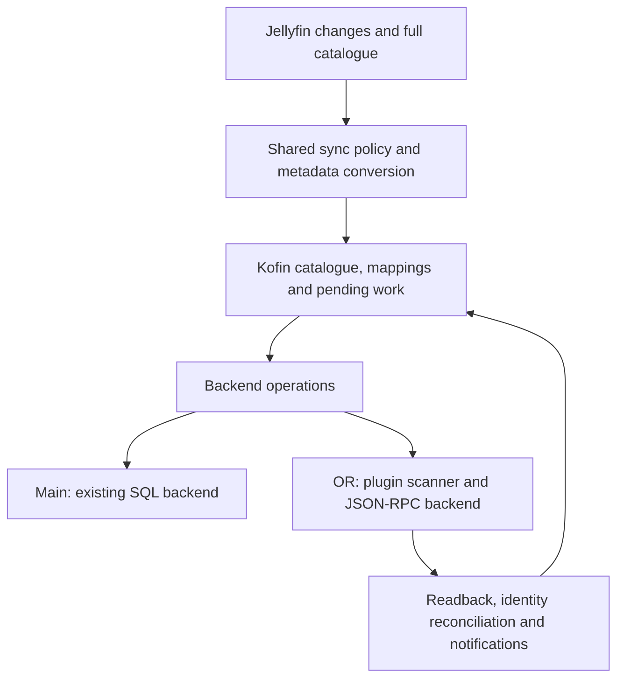

# Kofin official-repository variant: implementation plan

**Date:** 4 October 2026; phase 4 revised 8 October 2026

**Status:** phases 0–4 implemented; `0.90.0` was published as the first OR prerelease on 8 October 2026 and phase 4 (`0.91.0`) was implemented and verified on the P1D the same day. See the [phase 0 record](research/kofin-or/phase0/README.md), [phase 1 contracts and evidence](research/kofin-or/phase1/README.md), [phase 3 record](research/kofin-or/phase3/README.md) and [maintained parity ledger](kofin-or-parity.md). Native sync covers movies, shows, seasons, episodes, music videos and collections; see the [phase 4 record](research/kofin-or/phase4/README.md).

**Starting point:** baseline Kofin `main` at `db709a28905ca3b697d7135814407e9476d29361` / `0.29.0`; `repository.kontell` main at `b001a80a30987faf211b9a2add0834a10a6f2b90`.

**Evidence:** [Kodi API feasibility report](kodi-api-sync-feasibility.md), particularly §§3.2, 3.5, 8 and 9, and its [reproducible probes](research/kodi-api-sync/README.md).

## 1. Agreed direction and scope

Build `kofin-or` from `main`, using **plugin directory scanning for insertion, JSON-RPC for supported updates and reads, and Kofin-owned storage for catalogue state and recovery**. The first implementation targets Kodi Piers, with the P1D Piers Flatpak approved for development and release validation. A subsequent implementation targets stock Kodi v23 with upstream contributions addressing the remaining gaps.

| Decision | Implementation consequence |
|---|---|
| Piers or later | No Omega compatibility work, release gate or new Kofin package placement in the Omega feed. Validate the actual Piers API floor before publishing. |
| Plugin scanning is the chosen insertion route | No generated NFO/STRM catalogue. Close relevant ingestion gaps through Kodi contributions. |
| Development versions start at `0.90.0` | Reserve `0.90.x`–`0.99.x` for `kofin-or` development; publish these as GitHub prereleases. |
| Maintain `main` and `kofin-or` until parity | Extract shared policy and metadata transformations; keep backend differences contained and releases independent. |
| Shared MySQL is unnecessary | No shared-database ownership, coordination or Kofin MySQL test matrix. Use each Kodi client's local library backed by Jellyfin. |
| Migration means a fresh library | Rebuild Kodi's video/music library and Kofin's sync mappings. No adoption of legacy native IDs, paths or SQL-created relationships. |
| Versions/extras are initially lower priority | Retain extras browsing and media-source playback; provide an addon version chooser while deferring full native asset integration. Track this explicitly in the final parity decision. |
| Official-repository eligibility | The OR distribution must never directly access Kodi databases, including reads, repair, downloads, artwork or reset. Private Kofin SQLite remains allowed. |

This plan supersedes the feasibility report's earlier open choices about NFO/STRM, legacy-library adoption, Omega and shared MySQL. Its observations remain the evidence base.

**Recommended identities:** retain `plugin.video.kofin` for both variants; introduce **`repository.kontell.dev`**, named **Kontell Development Repository**, in the existing `repository.kontell` source repository. The same Kofin ID preserves plugin URLs and integration names. It means the variants cannot coexist in one Kodi profile: use separate profiles for development and the reset procedure when switching an existing profile.

“Official-repository variant” describes the target. Repository acceptance is a separate review and is not implied by the branch name or a development release.

## 2. Delivery phases and release milestones

Versions below are planned milestones, not one-release-per-phase promises. Use patch releases for fixes and additional previews. Dates depend on implementation evidence and Kodi review; v23 is the target for convergence, not an automatic deadline for retiring `main`.

| Phase | Deliverable | Release milestone | Depends on |
|---|---|---|---|
| 0 | Parity checklist, Piers baseline, branch and version policy | Branch starts at `0.90.0` | Current research |
| 1 | Shared sync contracts, private-state split and package boundaries | Internal builds of both branches | 0 |
| 2 | Development repository and prerelease automation | Working `repository.kontell.dev` installer | 0; alongside 1 |
| 3 | Complete movie lifecycle through Piers APIs | `0.90.0` prerelease, published 8 October 2026 | 1, 2 |
| 4 | TV, seasons, episodes, music videos and collections | `0.91.0` implemented and verified on the P1D, 8 October 2026 | 3 |
| 5 | Safe music ingestion, updates and removal | `0.92.x` | Snapshot foundation from 3 |
| 6 | Downloads, artwork, nodes, playback integration and policy cleanup | `0.93.x` | 4, 5 |
| 7 | Piers development candidate and official submission preparation | `0.94.x` | 3–6 |
| 8 | Scoped Kodi contributions from feasibility report §9 | Independent upstream PRs | Begin after 0; use later phases' evidence |
| 9 | v23 integration, parity validation and branch convergence | `0.95.x` onward; eventual `1.0.0` | 7 and relevant merged contributions |

Phases 1 and 2 can proceed independently. Phase 8 starts with small reproducible fixes while the Piers implementation proceeds; a new Kodi provider framework is **not** on the Piers critical path. Music's forced-rescan and failure behavior should be investigated in phase 0 so a late discovery does not invalidate the release sequence.

### Branch maintenance

1. Create `kofin-or` from the current `main` at implementation start. Record that base and protect both branches with CI. Bump the OR manifest/changelog to `0.90.0` in a distinct commit.
2. Land shared refactors and common fixes on `main` in small commits, then port them to `kofin-or` with `cherry-pick -x`. A common fix discovered on OR is ported back to main as a separately reviewable change. Record the counterpart commit in the PR.
3. Keep OR-specific backend, packaging, dependencies and version changes in separate commits. Avoid repeatedly merging unrelated SQL implementation changes into the API backend.
4. Keep shared modules at the same paths and with the same contracts on both branches. Review shared-file drift at each OR milestone and before releases. Assign a common change's propagation in the same PR rather than leaving it to a later branch cleanup.
5. Run the relevant backend tests on each branch and shared contract tests on both. A refactor is accepted only when the existing Piers SQL behavior is preserved and the API boundary is usable.
6. Main continues its existing release sequence below the reserved OR range. Keep versions globally unique for the shared addon ID and Git tags. Neither branch overwrites an existing release asset or tag.

The shared code stays in this repository. A separate shared package or third long-lived development branch would introduce another versioning problem without helping the initial split.

### Piers and v23 release families

- The Piers family is `0.90.x`–`0.94.x`, with a measured minimum supported Piers API floor. The P1D Piers Flatpak is approved for development and release validation. Record the exact build and pass the behavioral gates; there is no separate binary-provenance requirement or RC1-upgrade prerequisite. This acceptance policy was confirmed on 8 October 2026.
- The v23 family begins at `0.95.0`, with its own validated v23 floor. Keep the last compatible Piers release available in the Piers feed. Backport an essential Piers fix using a short-lived release branch if necessary.
- This avoids maintaining SQL-main, Piers-OR and v23-OR as three permanent feature branches. Supporting v23-only APIs does not silently deliver an incompatible update to Piers.
- `1.0.0` is the proposed convergence release, after the parity and repository-review gates. Keep both main and OR maintained if the required Kodi changes miss v23.

Keep OR previews out of both the stable Kontell feed and the public official repository until the planned stable cutover. Prepare the Piers submission and seek maintainer feedback earlier. With a shared addon ID, publishing a higher stable OR version could otherwise replace main for users who have not chosen to switch; early public official publication would require revisiting this rollout policy.

## 3. Shared architecture

### 3.1 Boundaries to introduce



Use operation-level contracts such as `stage_snapshot`, `apply_patch`, `resolve_identity`, `remove_owned_item`, `reconcile` and `reset_owned_content`. Specify completion and error behavior for each. Do not expose a pretend SQL cursor interface over JSON-RPC.

Use `xbmc.executeJSONRPC` inside Kodi for the API backend. Users do not need to enable Kodi's HTTP server or provide JSON-RPC credentials to run sync.

| Area | Shared responsibility | Backend responsibility |
|---|---|---|
| Server sync | Fetching, changefeed, library selection, checksum policy, retries and completeness checks | How desired content reaches Kodi |
| Metadata | Typed movie/show/episode/music DTOs, artwork mapping, credits, relationships and userdata policy | SQL serialization or InfoTag/JSON-RPC serialization |
| Identity | Server namespace, Jellyfin item/source identity and stable playback URL | Discovering and validating current Kodi IDs |
| Progress/recovery | Desired state, pending operations, attempted/applied generation, retry scheduling | Reporting confirmed results and recoverable failures |
| Downloads/playback | Selection, subscriptions, file validation, server reporting | Native metadata and presentation updates |
| UI/notifications | User-visible status, library selection and notification coalescing | Detecting native changes and refreshing affected views |

Suggested new locations are `sync/model.py`, `sync/backend.py` and `sync/backends/{sql,api}/`. Keep existing module paths behind thin wrappers where moving them would create unnecessary churn. Introduce the boundary incrementally around `workers.py`, `hooks.py` and the writers, which currently pass native cursors and inherit native SQL behavior.

Split the private database connection layer from `sync/db.py` early. OR must be able to use `kofin.db` without importing Kodi database discovery, native schema checks, WAL configuration or seeding. Distinguish Kofin schema migration from Kodi compatibility detection.

### 3.2 OR catalogue and application model

Persist enough data in Kofin's profile to serve a scanner without contacting Jellyfin:

- Stable server/user/library/item identities and complete normalized metadata.
- Immutable published directory generations, with completeness markers and the previous usable generation.
- Pending API operations, per-operation results, tombstones and refresh/removal intent.
- Kodi-ID mappings as validated caches, with a generation and ownership check.
- Expected userdata updates, origin/generation and expiry, so Kodi announcements can be distinguished from fresh user actions.

The application sequence is:

1. Fetch and validate server changes into a private transaction. Retain the existing completeness and deletion guards.
2. Publish a complete directory snapshot atomically in Kofin's store. A network failure must never publish an empty or partial replacement.
3. Queue the necessary scans, refreshes, patches and removals. Serialize conflicting operations for the same library or item; coalesce repeated edits.
4. Treat Kodi's immediate `OK` as acceptance, then wait for relevant completion announcements and perform bounded public-API readback. Persist pending work across service/Kodi restarts.
5. Reconcile actual identities and relationships, apply post-import userdata, and only then mark the desired generation applied and announce new content.

Fetched changefeed progress may advance once changes are durably recorded for replay; it must not imply native application succeeded. Maintain separate fetched and applied state. A mixed-success JSON-RPC batch retains the failed operations rather than rolling back successful calls or marking the whole batch successful.

Use a stable resolver URL derived from server and item identity, without a Kodi database ID, temporary stream URL or current download location. Preserve the tested query-style directory hierarchy; the research showed path-only URLs can change Kodi's parent-path binding. For music, validate the identity reconciliation strategy against duplicate/absent MBIDs and the public API rather than assuming video-style unique IDs are available.

The snapshot contract handles enumeration of the dedicated scanner directories, `kodi_action=refresh_info` and `kodi_action=check_exists` for imported items. Ordinary dynamic browsing remains live against Jellyfin as described in §3.4. Offline availability and deletion are different states: only a committed tombstone should report a known imported item gone. Pin an in-use snapshot until its scan finishes; retain the old complete directory during reconciliation to avoid exposing a half-published generation.

### 3.3 Package selection and shared maintenance

Choose the backend through explicit build/profile configuration, not a runtime “allow SQL” setting. Share the packaging manifest between `tools/build.py` and `tools/dev-install.sh` so development installation exercises the distribution that will ship.

The OR archive must exclude native SQL adapters, Kodi database discovery/seeding, texture SQL and the broad legacy SQL cleaner. Move shared helpers out of those modules before excluding them. A package import check and a file-access guard in integration tests must catch indirect native database access; a text search alone cannot prove compliance. Private SQLite tests remain enabled.

Every preview enables only features whose reachable paths have been converted. Disable or omit unfinished routes, settings and background work, with their availability stated in the release notes. This boundary applies from `0.90.0`: outside-sync SQL and installed-file mutation cannot remain active until phase 6. That phase completes the remaining feature ports and final audit.

Changes to Kofin's private state need a backend/version marker. Shared settings and download records must remain readable where promised, while SQL and API mappings cannot be mistaken for each other. Branch switches deliberately clear sync state; no two variants concurrently write the same profile.

### 3.4 Preserve dynamic browsing independently of native sync

Dynamic library browsing is an existing product capability and must remain available from the first OR preview, including media types whose native sync has not yet been implemented. The current root fetches Jellyfin views in `plugin/browse.py:root`; its listing handlers fetch server items, Next up, Continue watching, search, seasons, music and extras directly. `plugin/listitems.py` builds their Kodi ListItems, and dynamic context actions use the `kofin.id` property rather than requiring a native Kodi ID. These paths already use the architecture wanted for an official addon.

Keep the following explicit boundaries:

- **Live browser:** retain the existing Jellyfin-backed browsing routes, field-selection policy and server-side filters. Libraries omitted from native sync remain browsable. Browsing and streaming must work before initial sync, during sync and with no libraries selected for sync. The fresh-library transition gate blocks native sync, not otherwise valid dynamic browsing.
- **Scanner provider:** expose separate internal directories backed by complete committed snapshots. Kodi must not recursively scan the interactive root, search, Next up or user-dependent filter menus. The snapshot publication/completeness rules do not turn the live browser into a cached copy of selected native libraries.
- **Shared rendering:** reuse pure metadata conversions where useful, with separate browser/scanner serialization requirements. Preserve lightweight field requests and bounded cast/stream fetching for interactive lists; importing full metadata must not make every browser request fetch a sync-sized DTO.
- **Playback identity:** retain existing browse/play URLs as supported routes or aliases for favourites, widgets and shortcuts. Resolve unsynced items by Jellyfin identity even when no Kodi mapping exists. Reconcile current Kodi IDs only when an item is synced; do not make a native-ID lookup a prerequisite for dynamic playback.
- **Userdata and actions:** preserve dynamic watched/favourite toggles, resume reset, Play all/Shuffle, extras and playback of a specified media source. Adapt shared bookmark clearing and notification handling so an item reached through both dynamic and native views stays consistent without feedback loops. The resolver already accepts a media-source ID; the planned addon version chooser is an addition, not an existing dynamic menu. A missing native episode-tag or asset API does not prevent server-backed favourites, extras or that chooser.
- **Presentation:** preserve the browse entries and `Kofin.nodes.*` properties generated around `sync/views.py` even when sync is disabled or incomplete. Move the changing backdrop into the addon profile and update dynamic-listing consumers; audit badge consumers when renaming native artwork keys.

Keep browser/resolver changes shared between main and OR wherever the difference is not backend-specific. Native movie-only scope in `0.90.0`, for example, must not mean movie-only dynamic browsing. Downloads and other features with remaining SQL dependencies retain their separately stated preview availability until ported.

Add a dynamic-browsing regression gate to phase 1 and every published preview: no synced libraries, a mix of synced/unsynced libraries, an initial sync in progress, and a paused/failed sync. Cover root/drill-down browsing, filters, search, Next up, Continue watching, music Play all/Shuffle, extras/version selection, context actions, resume, widget/favourite URLs and playback. Measure listing latency during a large scan to catch contention. Existing offline-download behavior is tested separately; this work does not promise a new offline copy of the full dynamic catalogue.

## 4. Development repository

Phase 2 adds a second Kodi repository. `repository.kontell` keeps serving each addon's newest published release. `repository.kontell.dev` serves each addon's newest published prerelease. Drafts stay out of both. The dev repository does not also carry stable packages, and the stable repository does not also carry prereleases.

This is a filter on the publisher that already exists in `../repository.kontell`. `tools/update.py` lists the newest releases and drops anything with `isDraft` or `isPrerelease`. That filter stays for the stable tree. A second pass keeps rows with `isPrerelease` set and `isDraft` clear, and writes them under a `dev/` prefix using the same shared, dual and binary placement. The 30-release window, the newest-match rule, the complete-binary-set guard and the download-before-write guard are unchanged. Jellyfin plugins stay on the stable manifest; a prerelease of one is still ignored.

```text
omega/                              newest release (unchanged URLs)
piers/                              newest release (unchanged URLs)
dev/omega/                          newest prerelease
dev/piers/                          newest prerelease
repository.kontell-<version>.zip    stable installer (unchanged)
repository.kontell.dev-<version>.zip
```

When an addon has no prerelease, delete its directory under `dev/` and leave the stable directory as it is. Promoting a prerelease to a release then moves it on the next publish: the stable pass picks it up, and the dev pass removes the copy it no longer selects.

`generate_repo.py` writes `addons.xml` and `addons.xml.md5` for `dev/omega` and `dev/piers` the same way it does for `omega` and `piers`. The dev addon is a second source manifest, `repositories/repository.kontell.dev/addon.xml`, id `repository.kontell.dev`, name Kontell Development Repository. Its `<dir>` ranges match the stable addon and point at `https://repository.kontell.workers.dev/dev/omega` and `.../dev/piers`. Stage its zip into those two directories so Kodi can self-update it, and write the installer at the site root. The stable `addon.xml` URLs stay as they are. The Worker already forwards any path to Pages.

A shared addon is still one zip copied to both channels. Kofin `0.90.0` requires `xbmc.addon` 21.90.802, so Omega refuses it on the dependency. A later Kodi version is another channel and another `<dir>`, added the same way `piers/` was, when that work starts.

On `kofin-or` only, `release.yml` creates the draft with `prerelease: true`. Main's workflow does not. A person still publishes the draft. `notify-repo.yml` already listens for `release: published`, which fires when a prerelease is published from a draft, and that dispatch already runs `publish.yml`.

Installing `repository.kontell.dev` is the opt-in. A profile with only `repository.kontell` is offered releases. A profile with both installed is offered the higher version of the shared addon id, so a `0.90.x` prerelease updates that profile's Kofin. The two builds still cannot be installed side by side (§1). Removing the dev repository stops the prerelease offers. Going back to a main build is the existing fresh-library reset plus an install of the older version.

**Phase 2 acceptance:** one fixture list containing a release, a prerelease and a draft places the release under `omega/` and `piers/`, the prerelease under `dev/omega/` and `dev/piers/`, and the draft in neither. An addon whose only published item is a release has no `dev/` directory. After that prerelease is marked stable, a second run removes it from `dev/` and places it in the stable tree. On Piers, a profile with the dev repository installed is offered the prerelease, and a profile with only the stable repository is offered the release. `0.90.0` was published on 8 October 2026; the publisher side of the check passed the same day (`dev/piers` serves `0.90.0`, `piers` serves `0.29.0`), and the device-offer half is still to be recorded.

Unchanged: `addons.toml` models, the Worker, `publish.yml` triggers, the disabled schedule, Kofin CI, and any release-metadata file. The phase does not add a v23 feed, paginate past the current release window, or classify compatibility beyond the channel models already in `addons.toml`.

## 5. Phase work orders

### Phase 0 — Establish the baseline and acceptance ledger

**Work**

1. Turn feasibility report §8 into a tracked checklist: current-main behavior, Piers implementation/fallback, v23 requirement, validation scenario and status. Include the callers outside `lib/kofin/sync`.
2. Create the branch/version arrangement from §2. Record the baseline main release and update the parity checklist as shared features are added during parallel maintenance.
3. Reproduce the essential probes on Piers, recording build identity, Python capabilities and JSON-RPC methods/parameters. Use the approved P1D Piers Flatpak; its results count toward the behavioral acceptance gates.
4. Exercise forced music rescans, failed directory enumeration and metadata-only changes early. Confirm the source setup needed for movies, individual shows and music, and define the user setup needed where registration is not exposed.
5. Record initial SQL-main timings and behavior on a fixed test catalogue and the intended large library. Create a disposable Jellyfin fixture for deletion, interruption and userdata tests.

**Exit:** a concrete Piers capability floor, reproducible test setup, measured baseline and itemized parity ledger. No assumption that an immediate RPC success means native state is complete.

**Completed record:** [phase 0 results and reproduction](research/kofin-or/phase0/README.md). The manifest floor is `xbmc.addon >= 21.90.802` plus public/Python capability checks. The initial SQL baseline measures movie persistence on 100 fixed and 1,791 real DTOs in private databases, with three verified samples each. End-to-end mixed-library, GUI and artwork measurements remain later acceptance work. Music failed enumeration deletes old tracks on this build; a manual full tag rescan applies metadata-only changes and preserves song IDs. Phase 5 must resolve the resulting reliability and automatic-rescan policy before general music rollout.

### Phase 1 — Extract shared policy and establish the backend boundary

Implemented in [shared PR #260](https://github.com/kontell/plugin.video.kofin/pull/260), ported with provenance to OR. The [implementation record](research/kofin-or/phase1/README.md) covers the package/runtime inventory, dynamic-browsing gates and isolated SQL/API Piers evidence. The API selection is a separate OR commit; main stays on SQL.

**Work**

- Extract metadata normalization and sync decisions from writer inheritance into typed shared functions/objects. Preserve existing SQL output on main while introducing a place for InfoTag and JSON serializers.
- Refactor `workers.py`, `full_sync.py`, `library.py` and `hooks.py` to use backend operations/results instead of exposing a native cursor to shared policy. Keep the existing main adapter's transaction semantics within that adapter.
- Separate private database access and shared mappings from `kodidb`, and add desired/applied state needed by OR. Keep main's state migration small and backward behavior explicit.
- Introduce the package profiles and backend-specific import checks. Inventory native DB access throughout the addon, including playback lookups, cleanup, library claiming, textures and downloads.

**Exit:** shared tests pass on both branches; a Piers main full sync and delta retain baseline semantics. The OR package can start, access private storage and report capabilities with its native SQL modules excluded. No public OR release is needed until a complete vertical slice works.

### Phase 2 — Development repository

**Work**

- In `repository.kontell`, run the existing placement a second time for prereleases and write those zips under `dev/omega` and `dev/piers`. The stable tree keeps today's release filter. An addon with no prerelease loses its `dev/` directory.
- Add `repositories/repository.kontell.dev/addon.xml` and generate its `addons.xml`, checksum, self-update zip and root installer in the same publish run. Document the installer in the repository README.
- On `kofin-or`, set `prerelease: true` on the draft `release.yml` creates.

**Exit:** the §4 acceptance check. No OR release is published.

### Phase 3 — Deliver the movie vertical slice (`0.90.0`)

**Work**

- Build private catalogue generations, persistent pending operations, stable resolver URLs and the reset/first-run gate.
- Implement scanner directory routes and complete InfoTag construction. `addon.xml` already declares video scan paths; wire them to real snapshot-backed routes. Extend the existing `check_exists` handling, which currently validates URL shape, and implement `refresh_info`.
- Bind supported video sources using existing `VideoLibrary.SetSourceContent`; do not propose another upstream method for it. Handle the tested directory/query URL shape and source teardown.
- Implement movie insertion, detail patches, cast/stream refresh, supported art/tags/ratings/IDs, watched/resume reconciliation, ownership-checked removal and repair.
- Reconcile Kodi IDs after refresh and scan. Prevent echoing server-applied userdata back to Jellyfin using expected values and operation generations; continue to accept real user changes.
- Route playback through the shared resolver and exercise native library playback, stop/completion reporting and restart recovery.

**Exit:** add → update → play → watched/resume → refresh → remove works on Piers; repeat/restart does not duplicate content; offline and partial server responses do not delete valid content; foreign native items survive owned repair/removal. The dynamic-browsing gate in §3.4 passes independently of native movie sync. Release the first **`0.90.0` GitHub prerelease** through the development repository with the supported native-sync scope stated.

**Completed record:** [phase 3 implementation and installed-use follow-up](research/kofin-or/phase3/README.md). `0.90.0` was published as a GitHub prerelease on 8 October 2026 and `repository.kontell.dev` serves it under `dev/piers` while the stable feed stays on `0.29.0`. The installed-use fixes of 8 October — bulk removal, deselection during enumeration, the idle-time scan wait, no zero resume point on scanner rows and the first-content widget reload — are in the release, and the measurements behind them are the baseline phase 4 budgets against.

### Phase 4 — Complete the Piers video catalogue (`0.91.x`)

**Foundation first.** The phase 3 store and loop were measured on the installed catalogue on 8 October 2026 (1,792 movies) and do not scale to the phase 0 catalogue of 79 shows and 4,324 episodes: `kofin.db` had reached 235 MB; each `api_snapshot` generation is one 38.7 MB JSON blob that duplicates the per-item payloads and is re-encoded and compared on every publish and parsed on every pin, snapshot and `refresh_info`; the whole selection is re-enumerated with full fields every five minutes; and every readback is a whole-directory `GetMovies`, polled at 100 ms while a refresh converges. Resolve these before the first show is imported:

1. A snapshot is a generation plus ordered item ids per scanner directory. Each payload is stored once, in `api_item` or a content-addressed table. The native mapping is kind-generic with parent ids — the catalogue already carries `kind` — and generation garbage collection reclaims space (`VACUUM` or incremental auto-vacuum).
2. One scanner root per selected library and content type, with shows as subdirectories under their per-show binding (`containssingleitem=true`, phase 0). `RemoveContentForPath` on the root then removes a deselected library in one call for every type; the shared namespace directory of `0.90.0` allows that only when the whole namespace goes. Movies move to this layout in `0.91.0`. The ownership URL changes, so a 0.90.0 profile retires its old rows and re-imports automatically on first start; no reset is needed.
3. Enumeration runs on websocket events plus a watermarked catch-up on the SQL branch's contract. A full enumeration is Update library and a daily pass, not a five-minute timer.
4. Readback is scoped by show, season or path. A refresh is confirmed by id, and a full read runs only when the id has vanished.

**Work**

- Add TV/show/episode hierarchy, season names/plots/art, ordering fields, music videos and collection membership. Reproduce the per-show source-binding behavior from the probe: a binding per show directory, created at import and torn down with the library root.
- Define refresh scopes for fields absent from setters, preserve userdata around refresh and re-resolve changed IDs. A refresh changes the native id and restores the supplied userdata over patched values (phase 0), and `RefreshTVShow` does that to every episode of the show: episode-level cast and stream changes use `RefreshEpisode`; a show-level change refreshes the show and then re-applies userdata to every episode; sort numbering and the season plot join the refresh token as cast and streams did for movies. Measure one real show refresh on the P1D catalogue before accepting the design. Apply set/season details after native relationships exist.
- Handle duplicate names/identities, shared show relationships, removed episodes/seasons and collection changes without deleting another library's content.
- Retain Kofin views for episode favorites and empty entities that cannot be expressed or queried natively. Add a Kofin version chooser using the existing media-source resolver, retain the existing extras browser, and use stable asset playback identities. Dynamic views fetch live server metadata; native-sync callbacks use committed snapshots.
- Every rule from the 8 October fixes holds for the new types from the first line: a scanner row carries a resume point only when the server holds one, because the in-progress rule for episodes is the same bookmark-row test; removals are batched, a whole-directory clear uses `clearmode: "remove"` (`"clear"` only unbinds the scraper) and is followed by one `UpdateLibrary(video)`; a first-content skin reload fires per kind on `Library.HasContent(TVShows)` and `(MusicVideos)` as it does for movies; waits are idle-time, since a TV import at roughly 60 ms an item scans for minutes; the selection is re-read before publication.
- The episode detail pass is the GUI risk: every setter notifies and the skin's widgets re-fetch per notification (observed: one widget refresh per movie across a 1,788-row pass). Send independent patches as JSON-RPC arrays — 25 per batch measured fastest in the feasibility report §7.4 — measure UI responsiveness during the pass on the P1D catalogue, and pace it if the interface stalls.

**Exit:** all feasible Piers video functionality is represented in the checklist with tested behavior. Native episode tags and full native versions/extras remain identified gaps, not silently counted as parity. In addition: deselecting one of two libraries of the same type removes only that library's content, in one call, and a show present in both survives; Kodi's Clean Library with the add-on enabled deletes nothing; the In progress episodes and Next up widgets populate after first content without user action; a whole-namespace clear leaves no dangling native set; and a full TV import of the phase 0 catalogue completes without an error line, with wall time, API calls and GUI responsiveness recorded against the first API-path measurements (8 October 2026, 1,788 movies: scan 105–126 s, detail pass about 2.3 minutes at roughly 175 ms a row, removal 59–100 s).

**Completed record:** [phase 4 implementation and P1D verification](research/kofin-or/phase4/README.md). The foundation landed as planned — payloads stored once with interval membership, one scanner root per library and content type with bound show folders beneath the `tvshows/` root, a daily or Update-library enumeration with the change-feed catch-up between, scoped readback — and the 0.90.0 layout retires itself on first start. The installed catalogue (79 shows, 4,316 importable episodes, 1,788 movies, 54 collections) imported with zero detail patches: show scan 228 s, movie scan 100–132 s, apply passes 36 s, one of two show libraries removed in one call in about 40 s, Kodi's Clean Library with the add-on enabled removing nothing. Three of the exit's gaps stay gaps and are recorded as such in the ledger: empty seasons and unnumbered specials are invisible or unfileable to Kodi, and a show with one title and premiere in two libraries is merged by Kodi and healed rather than kept apart. Music videos are unit-tested only; the Kofin version chooser moves to phase 6.

### Phase 5 — Music with complete snapshots (`0.92.x`)

**Work**

- Choose stable directory boundaries for song-backed albums and artist relationships. Serve complete committed listings, including explicit empty committed directories for intentional deletion.
- Use modern music InfoTags plus the proven supported `setInfo("music", {"size": ...})` mechanism to mark tags loaded on Piers. Supply meaningful size metadata; isolate this workaround behind capability handling for the upstream fix.
- Import songs and reconcile the albums/artists Kodi creates. Apply playcount/last-played after import because the probe showed initial values were discarded. Treat song release-date updates according to the observed API mismatch.
- Ensure metadata-only changes trigger the required rescan; do not assume Kodi's path/size/date hash covers all tags. Prove normal and forced scans preserve valid tracks before enabling native music sync generally.
- Remove songs through complete-directory replacement and let Kodi perform observed orphan cleanup. Keep global `AudioLibrary.Clean` out of the normal removal path. Serialize replacement and preserve replay data if interruption occurs after native removal.
- Use supported user source registration where necessary; retain library/artist/album views in Kofin when native music source membership, empty entities or exact discography cannot be represented.

**Exit:** normal/forced scan, metadata-only update, two-to-one/one-to-zero deletion, server failure, plugin-listing failure and restart recovery pass. Include compilations, multiple credits, duplicate albums, no MBIDs, singles and multiple selected libraries. Native music-source and empty-entity gaps remain visible in the checklist.

If Piers cannot safely handle a required failure/rescan case, ship native music sync disabled for that affected configuration and retain plugin playback while pursuing the scoped Kodi fix. Do not present that configuration as complete Piers native-music support or let a failed listing masquerade as a valid empty album.

### Phase 6 — Finish integration and repository compliance (`0.93.x`)

**Work**

- **Downloads:** resolve local files before any required server call, keeping stable native plugin paths. Replace direct native file/song relocation. Validate subscriptions, download deletion, music playback continuity, native widgets/playlists, resume and reporting with the server unavailable.
- **Artwork:** precache through image VFS; use supported texture enumeration/removal only where needed. Discover actor art from DTOs/API. Rename the dotted download badge to a supported key such as `kofindownloaded`, updating consumers including Contuary where applicable; make shared consumers tolerate both keys during branch coexistence.
- **Presentation:** rewrite SQL-backed counts, lookup, widget fingerprints, ordered playlists and downloaded-music views using the private catalogue/public readback. Preserve playlist order and duplicates. Track ownership and user opt-in for generated global nodes/playlists, and clean up only tracked files.
- **Chapter art:** retain an addon chapter chooser if needed while native chapter-art integration remains an upstream item. Do not recreate texture aliases using SQL.
- **Whole-addon policy:** replace SQL library claiming and legacy cleanup paths; remove mutation of installed `addon.xml` for language-invoker settings and installed artwork for dynamic backdrops. Store changing content in the addon profile. Audit required/optional dependencies and official availability, including lyrics and inputstream integrations.
- **Reset/removal:** implement supported owned-content removal for OR, including committed music snapshot deletion. Distinguish removing Kofin content from the separate whole-profile migration reset.

**Exit:** the shipping OR archive has no reachable direct Kodi database access or installed-addon mutation. Native playback/download and UI flows pass on Piers. A missing optional addon reduces the corresponding optional feature without preventing core installation or sync.

### Phase 7 — Validate and prepare the Piers release (`0.94.x`)

Run the acceptance suite in §8 on the packaged addon and development repository. Fix correctness, recovery and performance defects before broadening the feature set. Publish the Piers limitations and their v23 tracking issues alongside the release notes.

Prepare the official repository submission with dependency metadata, licensing, translations/assets, profile-only storage and documented outside-profile opt-ins. Run Kodi's applicable addon checks at submission time. Seek maintainer feedback on the concrete Piers package before full parity; keep public distribution in the development feed until the stable cutover described in §2.

**Exit:** a Piers-supported build and an independently reviewable submission candidate. Main remains supported because this milestone does not imply parity.

## 6. Kodi v23 contribution programme (phase 8)

Recheck upstream master and open issues before each proposal. Use small reproductions from the research fixtures, discuss semantics before a large implementation, and submit separable PRs. Passing against a private patched Kodi build establishes a prototype; each shipping v23 feature must be verified against the stock build containing the merged change.

| Order | Contribution from report §9 | Required acceptance / Kofin benefit |
|---|---|---|
| 1 | Music metadata loaded/complete contract and forced-rescan behavior (§9.1) | Modern InfoTags import without side effects; failed/incomplete listings preserve valid state; intentional empty snapshots still remove content. Removes the Piers workaround and largest ingestion risk. |
| 1 | Song `releasedate` schema/implementation correction (§9.1) | Public set/read/clear round trip; refresh behavior defined. Small independent bug fix. |
| 2 | Season plot get/set and episode tag persistence/query/set (§9.1) | End-to-end round trips and native query behavior, including refresh/removal. Restores season update and native episode-favorite parity. |
| 2 | Reliable scanner/refresh job completion and resulting identities (§9.1) | Distinguish queued/running/failed/completed/cancelled work; reconcile without guessing from `OK`. Reduces races and repeated readback. |
| 3 | Scoped music source/snapshot/removal operations (§9.4) | Source membership, intentional removal, orphan cleanup and shared album/artist semantics defined without global cleanup. Address independent entities/credit/discography gaps where the parity checklist requires them. |
| 3 | Plugin ingestion fields and stream authority matching relevant NFO capabilities (§9.5 and §3.5) | Expose missing flags/asset associations as typed data; define when provider stream metadata wins or may be replaced. Kofin does not need to materialize NFOs to express the same information. |
| 4 | Native version/extra lifecycle (§9.2) | Typed asset creation, enumeration, label/default/metadata/userdata updates and removal; test default replacement, per-file bookmarks and export/import. Integrate after core catalogue stability. |
| 4 | Native chapter-art association and missing metadata/empty-entity access (§9.5) | Public ownership/lifecycle and native UI behavior proven; implement the gaps still required for parity. |
| Evidence-driven | Batched import/patch work or a provider/import API (§9.3) | Propose the smallest operation that resolves measured cost or correctness problems. Specify idempotency, ownership, per-item outcomes, cancellation and notification behavior. A complete new provider framework is optional. |

Prefer additions to the established plugin-scanner path where they meet the need. The NFO/STRM comparison identified API expressiveness and metadata-authority gaps, not a fundamental inability of plugin scanning to represent that data. Closing those gaps does not require making Kofin depend on a new importer subsystem.

Controlled native file relocation is conditional on the stable resolver failing a required playback use case. Extra texture-cache APIs are lower priority because the VFS route already works. `VideoLibrary.SetSourceContent` is already upstream and needs no new proposal.

Benchmarks compare main, supported Piers APIs and the proposed upstream change using the same catalogue: initial import, small deltas, metadata refresh, mass userdata, deletion, failure recovery, memory, UI responsiveness and announcement volume. Include P1D plus a slower supported device. **Shared MySQL is not a Kofin requirement or acceptance matrix**; Kodi contributions must still respect the core project's existing backend abstractions and whatever portability checks maintainers require.

Maintain a small table of issue/PR, intended Kodi release, merged build, test evidence and Kofin capability flag. Do not mark a gap closed when a PR is merely opened or merged without a stock-build integration test.

## 7. Fresh-library switch and rollback

The transition deliberately creates a new native library. Jellyfin remains authoritative for synced metadata and userdata; local unsent changes must be flushed before reset if they are to survive. Kodi database IDs and locally edited native relationships are not preserved.

### Existing main installation → OR

1. Stop new sync/playback work and finish pending userdata delivery before resetting if those changes are to survive. Enter a persistent transition mode so Kodi removal notifications are not interpreted as Jellyfin deletions or user edits.
2. While the existing main installation is still available, use its whole-library cleanup, or perform a user-controlled reset with Kodi stopped. The scope is the active profile's video/music library, including non-Kofin entries. For development, a separate clean profile is the simplest alternative.
3. Clear Kofin sync mappings, restore points, native IDs, applied markers and old generated source/node state. Preserve login/settings and physical downloaded media where compatible; retain only download records keyed by server/item identity and revalidate them. Discard native-path relocation state. Do not purge unrelated caches or downloaded files as a side effect of “fresh library”.
4. Install OR from the development repository, select libraries and create the new source bindings. Restore source-of-truth metadata/userdata from Jellyfin and validate existing downloads against the new private catalogue.
5. Rebuild fully, reconcile native results, then enable ordinary incremental sync and notification handling.

Implement a first-run gate that detects a legacy backend marker or a nonempty unprepared library through own state and public APIs. It must stop automatic sync and direct the user through the reset workflow; installing a higher numbered preview must not silently adopt a SQL-created library. Once initial setup has completed, OR's ordinary ownership rules protect any other subsequently added native content.

The OR addon does **not** perform a broad SQL nuke itself. The prerequisite reset happens through the existing main tool before switching, a new profile, or an external/user-controlled Kodi-stopped procedure. The feasibility report found no equivalent public operation that resets every native table to pristine. OR's own “remove Kofin content” operation is narrower and uses supported APIs/scans.

### OR → main, or recovery from a failed preview

Disable development updates, stop OR, explicitly install the selected main version, and repeat the fresh-library reset/rebuild with the correct backend marker. A lower version will not become the automatic winner simply because the development repository was disabled. Provide this procedure with the first `0.90.0` release and test it on a disposable profile.

### Piers OR → v23 OR

Aim to retain the private catalogue and stable plugin URLs across the API implementations. Let Kodi manage its own native schema upgrade, then re-probe capabilities and reconcile IDs. This is separate from adopting the legacy SQL library. If a changed upstream identity contract makes a rebuild necessary, use the same explicit fresh-library policy rather than inventing a Kodi-database migration in Kofin.

## 8. Verification and release gates

Tests must demonstrate behavior, especially failure recovery and native playback, rather than mirror serializer implementation. Reuse the existing test/live tooling and research provider. Test packaged distributions so excluded modules and dependency mistakes are visible.

| Gate | Evidence required |
|---|---|
| Shared maintenance | Both branches pass common contracts; main's supported Piers behavior remains stable after each shared refactor. |
| Official boundary | OR package/import audit plus integration guards show no Kodi database reads/writes from sync, playback, repair, artwork, downloads, reset or shutdown. |
| Native lifecycle | Add/update/refresh/remove and repeat produce the expected API-visible catalogue; ID changes do not duplicate objects or detach userdata. |
| Recovery | Restart between staging, queuing, native application and private commit; failed/partial batch; duplicate/reordered events; cancelled scan; Jellyfin unavailable. Pending work converges without false deletion. |
| Ownership | Kofin operations leave unrelated native content and shared relationships intact. Library deselection and server removal only remove confirmed owned content. |
| Music safety | Complete snapshot semantics; forced scan; metadata-only change; malformed/failed enumeration; empty committed snapshot; duplicate credits/MBIDs; interrupted replacement. |
| Userdata | Server/local watched, resume and ratings survive refresh and restart; no announcement feedback loop; conflicting real local edits are not swallowed by blanket suppression. |
| Dynamic browsing | Live Jellyfin listings and actions work with zero/partial native sync and during a scan; all existing media types remain browsable; unsynced playback, old plugin shortcuts and mixed dynamic/native userdata paths pass §3.4. |
| Playback/downloads | Native library, widget, playlist, remote-control and plugin starts; direct/transcoded media; track/stream selection; offline video/music; download/remove/re-download; completion and resume. |
| Presentation | Collection membership, episode ordering, artwork, renamed badges, library selection, counts and ordered playlists checked in Estuary and the supported custom-skin integration. |
| Distribution | §4: the stable repository serves releases and `repository.kontell.dev` serves prereleases. Verified on the publisher side for `0.90.0` on 8 October 2026 (`dev/piers` serves `0.90.0`, `piers` serves `0.29.0`); the device-offer half and the first patch release repeat it. |
| Performance | Fixed initial/delta/refresh/deletion workloads; wall time, API calls, pending backlog, notifications, peak memory and UI responsiveness, on Piers and later v23. |

Set explicit performance budgets after phase 0 measurements and record them in the parity ledger before optimizing. The small synthetic research timings are not release targets. Investigate refresh storms, full-catalogue scans for small deltas, repeated full-library readback, unbounded snapshots and GUI stalls specifically. Use bounded patches and coalesced scans, retaining correctness under cancellation.

The release matrix includes the approved P1D Piers Flatpak and, once integration begins, the relevant stock v23 builds. Add Windows/Android smoke coverage for path, dependency and packaging behavior before broad release. **No Omega or shared-MySQL qualification is required.** External research scripts may inspect native databases to diagnose a test, but those helpers never enter the addon distribution and shipped behavior cannot depend on their results.

## 9. v23 integration and retiring the SQL branch

After the relevant upstream work lands:

1. Implement the new capabilities behind the existing API backend contracts. Remove obsolete Piers workarounds from the v23 family once its minimum build guarantees the replacement.
2. Add a v23 channel and `<dir>` the same way `piers/` exists, publish `0.95.x` onward as prereleases through `repository.kontell.dev`, and rerun the lifecycle/recovery suite against stock v23.
3. Compare against the **then-current main**, not just the original `0.29.0` baseline. Close every parity ledger entry with native behavior, an explicitly accepted product change, or a documented remaining blocker.
4. Exercise final reset/install/update/rollback procedures and official-repository packaging. Submit/update the official review with the actual v23 candidate.
5. Once parity and release gates pass, converge the API implementation onto `main` using reviewed commits, retire the SQL backend and stop the long-lived branch split. Publish the agreed stable version, proposed as `1.0.0`, and retain historical release downloads.

**Parity means user-visible behavior and required native integration, not identical Kodi rows.** SQL transactions, cache row layout and native numeric IDs are implementation details that can be retired. Native source filters, episode tags, version menus and chapter art are observable features; an addon-only view is not automatically equivalent for skins and widgets.

Versions/extras are deferred initially, not silently removed from the final parity requirement. Restore whatever current-main asset functionality remains required, or explicitly agree its removal from scope before retiring main. Apply the same rule to independent music entities, source membership, discography and native chapter thumbnails.

If a required contribution is delayed beyond v23, retain the two branches and the honest feature matrix. If a narrow upstream change suffices, use it rather than waiting for the optional provider framework. The date of a Kodi release alone cannot establish parity.

## 10. First implementation PRs

Keep the first batch concrete and reviewable:

1. **Kofin:** branch/version setup, Piers capability baseline and tracked parity ledger.
2. **Kofin main → OR:** private database separation, typed shared metadata and backend result contracts, preserving current main behavior.
3. **Kofin:** package profiles, import boundary and CI coverage for OR.
4. **Repository:** `repository.kontell.dev`, prerelease placement under `dev/`, and the kofin-or draft marked prerelease.
5. **Kofin OR:** committed movie catalogue, scanner callbacks, stable resolver, pending operations, identity readback and first-run reset gate; publish `0.90.0` after the vertical slice passes.
6. **Kodi:** independent song release-date correction and music tag/forced-rescan reproductions with proposed API semantics.

This order gets a usable Piers preview into an automatically maintained development feed early, while the shared refactor and upstream work support the eventual v23 convergence.
