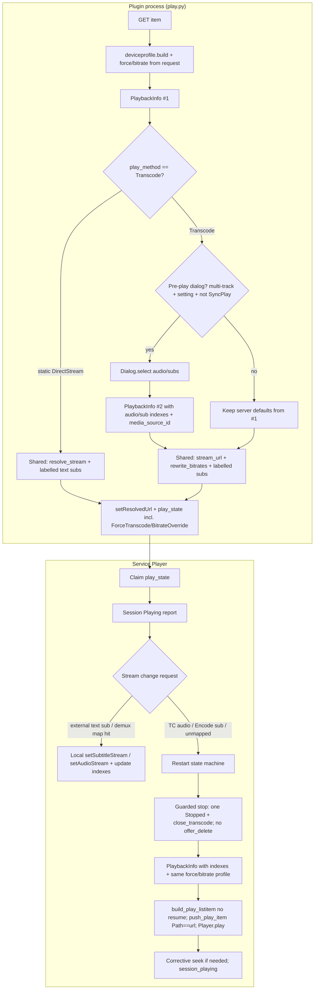

# Transcoding Stream Selection in Kofin

| Field | Value |
|---|---|
| **Document** | Transcoding Stream Selection — Design |
| **Target** | `plugin.video.kofin` (VOD / library playback) |
| **Author** | — |
| **Date** | 2026-07-29 |
| **Status** | Draft (rev. 3 — residual review fixes) |
| **Related** | `lib/kofin/plugin/play.py`, `lib/kofin/core/deviceprofile.py`, `lib/kofin/service/player.py`, `lib/kofin/service/remote.py`; workspace `notes/jellyfin-transcoding-analysis.md` (monorepo root, not under the addon tree) |
| **Out of scope** | `pvr.kofin` live TV (follow-on); music-only playback; server-side StreamBuilder changes |

---

## Overview

Kofin resolves playback in a non-interactive plugin path: device profile → `POST /Items/{id}/PlaybackInfo` → pick source → stream URL → `ListItem.setSubtitles(urls)` → `setResolvedUrl`. That design deliberately dropped jellyfin-kodi’s pre-play audio/subtitle dialogs in favour of “the profile decides everything.” The cost is a **capability gap under remux/transcode**: the HLS session typically carries a single baked-in audio track (and often no switchable embedded subs), so Kodi’s native OSD cannot list other tracks the way it can for direct play of a multi-track container. External subtitle URLs are attached, but with **URL-only labels** that appear garbled in the native subtitle dialog.

This document proposes a **native-first hybrid** stream-selection architecture for static DirectStream and full Transcode (as named by kofin today):

1. **Text subtitles** become first-class native Kodi streams (labelled external files via `setSubtitles`) for both direct play and transcode, with mid-play switching free of restarts.
2. **Audio under transcode** uses server defaults, an optional pre-play dialog, remote-driven **position-preserving PlaybackInfo restart**, and (in a dedicated PR) a local fallback picker when the demuxer cannot list source tracks. Custom UI is **only** where native selection cannot work.
3. **Burn-in (`Encode`)** stays **off by default** and is only opt-in for image-based / forced-accessibility cases.
4. Default track choice is driven by **Jellyfin’s PlaybackInfo defaults** (which already encode user language prefs), with a precise client mapping of Jellyfin subtitle modes; Kodi language settings apply only to demuxed/external presentation after attach.

### Product expectation by PR (honest scope)

| Capability | Who owns UX | Available from |
|---|---|---|
| Native OSD for **all attached/demuxed** audio + text external subs | Kodi OSD | PR1 (subs labels/attach); demux audio already works on static |
| Garbled external sub labels fixed | PR1 | PR1 |
| Accurate session progress indexes after OSD sub/audio change | PR2 | PR2 |
| Mid-play **TC audio** change | **Remote** (dashboard) via restart | PR3 |
| Initial TC track choice when defaults wrong | Optional pre-play dialog (default off) | **PR4** (can ship after PR1 for *initial* indexes without waiting on restart) |
| Local mid-play **TC audio** without dashboard | Fallback “Audio tracks…” action | **PR5** (local audio UX deliverable — not polish) |
| Image/PGS under TC | Encode opt-in + restart | PR4+ |

**Native OSD owns all attached/demuxed tracks. Transcode audio is defaults + remote restart (PR3) + optional pre-play (PR4) + optional local fallback picker (PR5).** After PR1–PR3 alone, wrong TC audio language still requires the dashboard remote (or stop/replay) unless the user enabled pre-play in PR4. That is an accepted interim product state, not a claim that PR3 delivers full native TC audio OSD.

No server changes are required for the core plan. Multi-audio HLS from Jellyfin is treated as an open verification item (spike before/during PR3), not a hard dependency.

---

## Background & Motivation

### Current play resolve (`lib/kofin/plugin/play.py`)

```
item → deviceprofile.build → api.playback_info → pick_media_source
    → stream_url → listitems.build → external_subtitles → li.setSubtitles
    → setResolvedUrl + state.push_play_item
```

Documented contract (module docstring):

> No interactive dialogs in this path — the device profile decides everything.

Relevant facts:

| Piece | Behaviour today |
|---|---|
| `external_subtitles()` | Keeps streams with `Type==Subtitle`, `IsExternal`, `DeliveryUrl`, `DeliveryMethod=="External"`; returns raw `server+DeliveryUrl` list |
| `li.setSubtitles(urls)` | Kodi labels tracks from path/URL basename → **garbled** for long query-string DeliveryUrls |
| `play_state` | Stores `AudioStreamIndex` / `SubtitleStreamIndex` from `DefaultAudioStreamIndex` / `DefaultSubtitleStreamIndex` only for progress; **does not** store force-transcode or bitrate override |
| `api.playback_info` | Already accepts `audio_index` / `subtitle_index` / `media_source_id` / `max_bitrate` — unused by `play()` for track choice |
| Device profile `SubtitleProfiles` | Every format in `SUBTITLE_FORMATS` with methods **Embed** and **External** only — **no Encode, no Hls** |
| Remote `SetAudioStreamIndex` / `SetSubtitleStreamIndex` | Registered as capabilities in `service/main.py` but **deferred** in `service/remote.py` (“need source-mapping”); handlers run on the **websocket thread** (must stay non-blocking) |
| Context force TC | `play.py` params `transcode=1` / `bitrate=` → `deviceprofile.build(..., force_transcode=..., bitrate_override_mbps=...)` + `rewrite_bitrates` — **ephemeral to that resolve only** |

### Three play methods (must not be collapsed)

| Method | How kofin names it | What the client receives | Stream selection reality |
|---|---|---|---|
| **DirectPlay** (server term) | Client reports `DirectStream` when using `/Videos/{id}/stream?static=true` (see `stream_url` docstring — remux and true file play both report `DirectStream` for session-close consistency) | Full static file/container | All audio + embedded subs demuxable; external via `setSubtitles` |
| **DirectStream (remux)** | When `SupportsDirectPlay` or `SupportsDirectStream`, kofin **always** builds the **static** URL today (`stream_url`) — there is **no client remux-HLS path** | Static stream | Multi-audio typically demuxable from static container |
| **Transcode** | `PlayMethod == "Transcode"` + `TranscodingUrl` (HLS TS/fMP4) when both SupportsDirectPlay and SupportsDirectStream are false | Single video + single audio elementary stream in playlist | Only the indexes chosen at PlaybackInfo time; mid-play change needs new session |

`play.py` intentionally reports every non-static path as `Transcode` and static as `DirectStream`. Session progress and `close_transcode` key off `PlayMethod == "Transcode"`. Design work that restarts sessions must preserve that signal **and** any force/bitrate overrides that produced the original Transcode.

### Server pipeline (from workspace `notes/jellyfin-transcoding-analysis.md`)

Phase 1 (`POST PlaybackInfo` + DeviceProfile) chooses play method, default audio/subtitle, and whether subtitles can be delivered without burn-in. Subtitle delivery methods known to Jellyfin:

| Method | Meaning | Mid-play switchable on client? |
|---|---|---|
| **Embed** | In-container | Yes if client demuxes the container (static DirectStream) |
| **External** | Separate downloadable/extractable track | Yes via `setSubtitles` / player external list (text only — see §5) |
| **Hls** | WebVTT (or similar) in HLS playlist | Yes if player surfaces HLS text tracks |
| **Encode** | Burned into video frames | **No** without re-transcode |

Text-based (SRT/ASS/SSA/…) can usually be External without video re-encode. Image-based (PGS/DVD/VobSub) often force Encode if the client insists on showing them during a transcode — CPU-heavy and track-locked.

### jellyfin-kodi historical approach (reference, not template)

`jellyfin_kodi/helper/playutils.py` (upstream) does three things kofin currently does not:

1. **Pre-play dialogs** gated by `skipDialogTranscode` that splice `AudioStreamIndex` / `SubtitleStreamIndex` (and optionally `SubtitleMethod=Encode`) into the transcoding URL.
2. **Download external subs** to addon temp as `{sourceId}.{Language}.{Codec}` so Kodi shows language-coded names; build a **Kodi-index → Jellyfin-index** map (`SubsMapping`) for progress reporting.
3. **Allow burned subs** via `allowBurnedSubs` when extraction/external is unavailable.

Rewrite research (`docs/rewrite-research.md`) **explicitly dropped** “custom … audio-sub/transcode dialogs” in favour of native resume + settings-driven profile. This design **keeps that philosophy**: native OSD first; optional dialog only when native selection cannot work; no permanent custom audio/sub picker for the happy path. Unlike jellyfin-kodi, **index changes always go through a second PlaybackInfo** when they affect server planning (not URL-only splice as the primary path).

### Pain points

1. Transcode users cannot change audio mid-play; wrong default language is a full stop/restart dance outside the addon.
2. External subs in the native dialog show as unreadable URLs (direct play **and** transcode).
3. Embedded text subs that the server could extract as External are filtered out by the `IsExternal` requirement.
4. Remote dashboard stream-index commands are advertised but no-ops.
5. No path to image-based subs under transcode without inventing Encode policy.
6. Context force-transcode / bitrate is not durable on play_state — any mid-play restart that rebuilds from settings alone would silently drop force-TC.

---

## Goals & Non-Goals

### Goals

- G1. Native Kodi audio/subtitle OSD works for **all tracks that can be delivered without re-encoding video** (**text** external/extracted subs always; multi-audio when present in the demuxer). Image tracks are not attached via `setSubtitles`.
- G2. Fix garbled external subtitle labels for direct play and transcode.
- G3. Mid-play subtitle switching among external **text** tracks without restart.
- G4. Mid-play audio (and burn-in / non-external subtitle) switching under Transcode via **position-preserving session restart**, driven by remote control and (PR5) a local fallback action; optional pre-play prompt when starting a transcode.
- G5. Default track policy that respects Jellyfin user language prefs at PlaybackInfo time, with an explicit Jellyfin-mode → client-action table; no second preference engine that fights Kodi OSD choices.
- G6. Burn-in off by default; explicit opt-in with clear cost.
- G7. Wire `SetAudioStreamIndex` / `SetSubtitleStreamIndex` remote commands with a **defined** Jellyfin↔Kodi index mapping algorithm.
- G8. Incremental, testable PRs; pure client work first.
- G9. Restart preserves force-transcode, bitrate override, media source id, and bitrate rewrite of the original resolve.

### Non-Goals

- N1. Server StreamBuilder / multi-rendition HLS fixes (may be noted as future; not blocking).
- N2. `pvr.kofin` live multi-audio (known separate server bugs; out of scope).
- N3. Reintroducing a permanent custom audio/sub “always ask” UX as the primary path (jellyfin-kodi default mode).
- N4. Cinema mode / trailer stack redesign.
- N5. Changing DirectPlay vs Transcode decision logic beyond subtitle-profile advertisements needed for delivery method selection (with Encode contingency if DP rates regress — §2).
- N6. Perfect seamless A/V switch with zero gap under full video re-encode (gap is inherent to restart).
- N7. SyncPlay-coordinated track changes across group members (v1: refuse local restart/dialogs while any SyncPlay group is active).

---

## Proposed Design

### Design principles

1. **Native UI wins for what the demuxer/listitem can expose.** Prefer `ListItem.setSubtitles`, Kodi Player stream lists, and OSD. Custom `Dialog.select` only for pre-start TC choice (opt-in) or the PR5 TC-audio fallback.
2. **Delivery over burn-in.** Prefer External text over Encode. Never attach image codecs via `setSubtitles`.
3. **Indexes are Jellyfin’s.** Progress, remote commands, and restarts always speak Jellyfin `MediaStreams[].Index`. Maintain explicit Kodi↔Jellyfin maps (§6.4).
4. **Shared resolve core.** Plugin `play()` and service restart share `core/playback.py` builders so force/bitrate/mime/subs/listitem cannot drift.
5. **Second PlaybackInfo for server-affecting choices.** Dialog and restart always re-plan via PlaybackInfo with indexes; URL-only splice is not the primary path.
6. **Websocket thread stays non-blocking.** Remote stream commands enqueue work onto a player-owned queue/worker (same discipline as SyncPlay).

### Architecture



### 1. Native-first stream selection strategy

#### Feasibility matrix

| Approach | Subtitles (text) | Subtitles (image) | Audio | Feasibility on Jellyfin 10.11 + Kodi Omega |
|---|---|---|---|---|
| **(a)** External / extracted **text** via `setSubtitles` | Excellent | Never via setSubtitles | N/A | **High** |
| **(b)** Multi-audio HLS / multi-rendition | N/A | N/A | Ideal if server emits ALT audio groups | **Unverified** — spike task before/during PR3 |
| **(c)** Intercept stream-change → restart | N/A if (a) works | Yes for Encode switches | Remote / fallback picker; not pure OSD under single-track HLS | **Medium** |
| **(d)** Hybrid | (a) native | optional Encode + restart | defaults + optional pre-play + remote restart + PR5 local picker | **Recommended** |

#### Recommended primary approach: **Hybrid (d)**

**Phase A — Text subtitles native (no restart)** — PR1/PR2

1. Text-only external eligibility + language-coded temp files (§5).
2. `SubsAttachOrder` at resolve; absolute `SubsMapping` after service reconcile (§5.1).
3. Observe OSD sub changes via absolute indexes → progress only (never restart).

**Phase B — Audio / locked tracks via restart** — PR3+

1. Server `DefaultAudioStreamIndex` (and optional pre-play) chooses the baked track.
2. Mid-play audio change paths:
   - **Remote** `SetAudioStreamIndex` → restart (PR3).
   - **Local fallback** “Audio tracks…” (PR5) when `PlayMethod==Transcode` and `len(AudioStreams)>1`.
   - **Not promised:** native audio OSD listing all *source* tracks under single-rendition HLS.

**Phase C — Multi-audio HLS (opportunistic)**

If the spike shows Jellyfin emits alternate audio that Kodi lists, prefer local `setAudioStream` and skip restart for those sessions.

#### Why not pure jellyfin-kodi dialogs?

They block every transcode, train users away from native OSD, and were an explicit rewrite non-goal. Optional pre-play (default **off**) recovers the “pick once before costly encode” case.

### 2. Burn-in analysis (`Encode`)

#### When burn-in is justified

| Case | Why Encode helps | Cost |
|---|---|---|
| Image-based PGS / VobSub / DVD under HLS | No useful External **text**; only way to see the track | Full video re-encode; locked track; high CPU/GPU |
| Forced narrative image subs | Accessibility / plot-critical | Same |

#### When burn-in should be avoided

- Any **text** track with External delivery.
- Default-on Encode for all formats (can force TC / affect DP eligibility when a default PGS track exists).
- Using Encode merely to populate a native list — text External is better.

#### Profile recommendation

| Setting | Default | Profile effect |
|---|---|---|
| Advertise **Embed** + **External** for all current `SUBTITLE_FORMATS` | **Keep** (today) | Text + sidecar delivery |
| Advertise **Encode** for `pgssub` / `pgs` / `dvdsub` only | **Off** unless `allowBurnedSubs` | Server may burn when user selects an image track with indexes on PlaybackInfo |
| Advertise **Hls** | **Deferred** | Double-list risk with `setSubtitles` |

**v1:** when `allowBurnedSubs` is true, Encode rows are added on **every** profile build for those three image formats (simple).  

**Contingency:** if live tests show DirectPlay regressions when a default PGS track is present with Encode advertised (server subtitle-compatibility checks), switch to **second profile build only when the user selected an image track** (pre-play or restart with image `SubtitleStreamIndex`). Document S-TS.6/S-TS.7 + a DP-rate probe with `allowBurnedSubs=true` and default PGS.

Never pass burn-in for text tracks. Image tracks never go through `setSubtitles`.

### 3. Default track selection policy

#### Sources of truth

| Source | What it knows | Feeds |
|---|---|---|
| Jellyfin user prefs + StreamBuilder | Preferred languages, mode, forced handling → `DefaultAudioStreamIndex` / `DefaultSubtitleStreamIndex` | PlaybackInfo indexes only |
| Kodi player settings | Preferred languages for demuxed/external tracks | Presentation after open; **never** fed into PlaybackInfo (K3) |
| Media `IsDefault` / `IsForced` | Media-author flags | Server-side (and client one-shot table below) |

#### Jellyfin subtitle mode → client action

Jellyfin’s effective default arrives as `DefaultSubtitleStreamIndex` (null/absent = none). Client behaviour after attach:

| Server outcome | Client action at start | Later |
|---|---|---|
| `DefaultSubtitleStreamIndex` null / absent | **Do not** call `Player.setSubtitleStream`. Leave Kodi’s own default (often off or language-matched). | PR2 only **observes** user OSD choices for reporting |
| Default index points at an **attached external text** track, and stream `IsForced` is true | One-shot `setSubtitleStream(kodi_index)` + enable after `onAVStarted` | Do not re-apply if user later disables |
| Default index points at attached external text, stream not forced | **Do not** force-enable. Rely on Kodi preferred-language auto-select when lang codes are recognised (`eng`, etc.). If live S-TS shows Kodi never auto-enables addon externals, product follow-up — not a silent Always engine in v1 | Observation only |
| Default index is **embedded** (static DirectStream) | Leave to Kodi demuxer / language settings | Map demux index → Jellyfin for progress (PR2) |
| Default index is image / Encode-only | Only if `allowBurnedSubs` and indexes were planned into PlaybackInfo; otherwise ignore for client enable | Restart required to change |

**Audio:** always start with server `DefaultAudioStreamIndex` baked into the Transcode session or present in the static container; no client re-pick unless dialog/remote/PR5.

**Never** override an explicit user OSD choice after start (PR2 updates reported indexes only).

### 4. Optional pre-play dialog

#### Setting

Under **Transcoding**:

| Setting id | Type | Default | Label intent |
|---|---|---|---|
| `transcodeStreamSelect` | enum int | `0` = Never | Never / Audio & Subtitles / Audio only / Subtitles only |

#### When is it necessary?

Show the relevant dialog **only if all** hold:

1. `play_method == "Transcode"` after first PlaybackInfo + `stream_url` — **not** static DirectStream. (Today kofin never uses a remux-HLS client path; do not invent one in the gate.)
2. Setting requests that axis (audio and/or subs).
3. **Multiple candidates:**
   - Audio: `count(Type==Audio) > 1`
   - Subs: `count(eligible_dialog_subs) > 1` (skip single-track noise)
4. Item is video (`Movie` / `Episode` / `Video` / `MusicVideo`).
5. **No SyncPlay group is active** (controller **or** follower — any group). Plugin-process detection is **not** via `player.syncplay_group_active` (service-only attribute) and **must not** reuse `kofin.sync.active` (that is **library sync**, `core/state.py`). Use the concrete signals in §4.1 below. If active → skip dialog, use server defaults.

#### 4.1 Plugin SyncPlay detection (concrete, required for PR4)

The plugin process cannot read `Player.syncplay_group_active`. Implement **both** signals:

| Signal | Who sets it | How plugin reads it |
|---|---|---|
| **`syncplay=1` query param** | **Mandatory.** All SyncPlay-initiated plugin play URLs | `request.params.get("syncplay") == "1"` |
| **`kofin.syncplay.active` window property** | **Optional but recommended.** Service mirrors `player.syncplay_group_active` | `state` helper / `Window(10000).getProperty` — for any resolve path that lacks the query param |

**URL change (today vs required):**

```python
# syncplay/playback.py play_item — today only mode/id/startticks
params = {
    "mode": "play",
    "id": str(item_id),
    "syncplay": "1",          # REQUIRED — plugin dialog gate
}
if start_ticks:
    params["startticks"] = str(int(start_ticks))
```

Also add `syncplay=1` to any other SyncPlay playlist/entry builder that starts VOD via plugin URL (search `plugin_url` / `mode=play` under `syncplay/`).

**Window property (service):**

```python
# core/state.py — new prop, distinct from PROP_SYNC_ACTIVE (library sync)
PROP_SYNCPLAY_ACTIVE = "kofin.syncplay.active"

def set_syncplay_active(active: bool) -> None: ...
def is_syncplay_active() -> bool: ...
```

Set/clear whenever `player.syncplay_group_active` flips (manager join/leave). Earns its place in `state.py` like other cross-process flags.

**Plugin gate helper (unit-tested):**

```python
def suppress_stream_dialogs(request_params: dict) -> bool:
    if request_params.get("syncplay") == "1":
        return True
    return state.is_syncplay_active()  # window prop; false if unset
```

Pre-play dialogs call this before any `Dialog.select`. Service restart/remote paths continue to use `player.syncplay_group_active` directly (already correct).

**Do not:** treat `kofin.sync.active` / `kofin.sync.stop` as SyncPlay — those mean library sync workers.

**Eligible dialog subtitle streams:**

- Text external/extractable (same allowlist as §5).
- Image-based (`pgssub`/`pgs`/`dvdsub` etc.) **only if** `allowBurnedSubs`.

Include a **“No subtitles”** row (maps to subtitle off on second PlaybackInfo — see Open Question 3; resolve before PR4 merge).

#### Label helpers (pure, unit-tested)

```python
def format_stream_label(stream: dict) -> str:
    """Prefer server DisplayTitle; else Language - Codec Channels ch."""
    title = (stream.get("DisplayTitle") or "").strip()
    if title:
        return title
    lang = stream.get("Language") or "und"
    codec = (stream.get("Codec") or "").upper()
    ch = stream.get("Channels")
    if stream.get("Type") == "Audio" and ch:
        return "%s - %s %sch" % (lang, codec, ch)
    return "%s - %s" % (lang, codec) if codec else lang

def eligible_audio_streams(source: dict) -> list[dict]:
    return [s for s in (source.get("MediaStreams") or []) if s.get("Type") == "Audio"]

def eligible_dialog_subs(source: dict, *, allow_burned: bool) -> list[dict]:
    ...
```

#### Second PlaybackInfo after dialog (mandatory)

```
PlaybackInfo #1 (probe defaults / method)
  → if dialog needed: Dialog.select
  → PlaybackInfo #2(
        profile,  # same force/bitrate config
        audio_index=chosen or default,
        subtitle_index=chosen or omit/off,
        media_source_id=source.Id,
        start_ticks=...
     )
  → stream_url + rewrite_bitrates(budget) on #2 result
  → labelled text subs from #2 MediaStreams
```

URL-only splice of `AudioStreamIndex`/`SubtitleStreamIndex` onto `TranscodingUrl` is **not** the primary path (burn-in and remux-vs-TC decisions are planning-phase). Reserve splice only if live tests prove parity for text-only cases; default implementation is second PlaybackInfo.

#### Safe introduction of dialogs into `play.py`

Plugin process may block on `xbmcgui.Dialog().select` **before** `setResolvedUrl`. Never on service callback / websocket threads. Default setting Never → zero behaviour change. Cancel → `_fail`. SyncPlay → no dialog.

### 5. Fix garbled external subtitle descriptions

#### Root cause

```167:177:lib/kofin/plugin/play.py
def external_subtitles(server: str, source: JsonDict) -> List[str]:
    urls = []
    for stream in source.get("MediaStreams") or []:
        if (
            stream.get("Type") == "Subtitle"
            and stream.get("IsExternal")
            and stream.get("DeliveryUrl")
            and stream.get("DeliveryMethod") == "External"
        ):
            urls.append(server + stream["DeliveryUrl"])
    return urls
```

Kodi labels external subs from the **filename** component. Jellyfin DeliveryUrls produce unreadable basenames. Requiring `IsExternal` also drops extractable text.

#### Text-only allowlist

```python
TEXT_SUB_CODECS = frozenset({
    "srt", "ass", "ssa", "vtt", "webvtt", "smi", "sub", "txt",
})
# Explicitly excluded from setSubtitles / download:
# "pgssub", "pgs", "dvdsub", "dvbsub", "xsub", "vobsub", ...
```

Eligibility for attach/download:

```python
Type == "Subtitle"
and DeliveryMethod == "External"
and DeliveryUrl
and codec_normalized in TEXT_SUB_CODECS
# SupportsExternalStream: if key present and False, skip; if missing, allow
```

Image tracks with External delivery are **not** downloaded or attached. They appear only via Encode opt-in + PlaybackInfo indexes + restart.

#### Filename convention (Kodi Omega)

Minimum (jellyfin-kodi-proven pattern):

```
{Index:02d}.{lang}.{codec}
# e.g. 03.eng.srt , 05.swe.ass
```

- `lang`: Jellyfin `Language` lowercased if it looks like ISO 639-1/2 (`^[a-z]{2,3}$`); else `und`. Do **not** embed free-form `DisplayTitle` in the filename (noise for language parsers: “English (SDH)”, forced flags, punctuation).
- Extension = normalized codec (`srt`, `ass`, …).
- Optional future: Kodi 22 BCP-47 — out of Omega floor.

**Expected on-screen label:** language token from the basename (e.g. `eng`) plus extension; users see recognisable language codes rather than URLs. Full `DisplayTitle` remains available in pre-play dialog labels via `format_stream_label`, not in the external file name.

Omega auto-select of preferred subtitle language depends on Kodi Player settings **and** a recognisable lang code; `und` will not match a preferred language.

#### Materialization

| Detail | Spec |
|---|---|
| Directory | `special://profile/addon_data/plugin.video.kofin/subs/{PlaySessionId}/` via `xbmcvfs.translatePath` / `xbmcvfs.mkdirs` |
| Download | Authenticated GET; **timeout** (e.g. 10s); **max size** (e.g. 2 MiB) — refuse oversized body before write |
| Memory | Stream-to-file if practical; never attach multi-MB image by accident (allowlist prevents) |
| Failure | Fall back to raw URL for that track (current behaviour) |
| Cleanup | Best-effort `rmtree` session dir on guarded finalize / real stop (**PR1**); age-based reaper on **service start** (delete `subs/*` older than 24h) in **PR1**, not deferred to PR5; wipe entire `subs/` on `AUTH_CHANGED` / user switch (**PR1** hook in service) |
| Mapping | See §5.1 / §6.4 — **absolute** Kodi player indexes after reconcile, not attachment order alone |

#### 5.1 SubsMapping lifecycle (provisional → absolute)

At `setSubtitles` time the plugin only knows **attachment order** (`0..n-1` among paths passed to `setSubtitles`). On Omega, `Player.setSubtitleStream` / current-stream observation use **absolute** player indexes. When embedded demuxed subs and external files coexist (common on static DirectStream), absolute indexes are typically:

```text
absolute_kodi_index = embedded_subtitle_count + attachment_order
```

not `attachment_order` alone. Pure-transcode sessions with **only** externals often luck into equality (`embedded_count == 0`); mixed DirectStream does not.

**Play-state fields:**

```python
"SubsAttachOrder": [3, 5],   # jellyfin indexes in setSubtitles order (immutable)
"SubsPaths": [".../03.eng.srt", "..."],  # optional, for path/basename match
"SubsMapping": {},           # absolute_kodi_index -> jellyfin_index; empty until reconciled
"SubsMappingReady": false,   # true only after service reconcile
```

**Reconcile (service, after streams exist):** e.g. `onAVStarted` or first non-empty `getAvailableSubtitleStreams()` / JSON-RPC `Player.GetProperties` → `subtitles` / `currentsubtitle`:

1. Prefer match attached files by **basename** (or full path) against Kodi’s listed subtitle stream names/paths.
2. Fallback: `absolute = len(embedded_or_pre_external) + attachment_order` when Kodi lists externals after embedded in stable order.
3. Write absolute `SubsMapping` and set `SubsMappingReady=true`.
4. Until reconciled: PR2 may report server defaults only; **remote local `setSubtitleStream` for external tracks is refused** (log: mapping provisional). After ready, reverse-map Jellyfin → absolute Kodi index.

Unit-test pure offset math: embedded + 2 externals → keys `e, e+1`; TC externals-only → `0..n-1`. Live: static with embedded+external, remote set sub hits the correct track.

### 6. Mid-playback switching under transcode

#### 6.1 Shared resolve module (`lib/kofin/core/playback.py`)

Extract pure/shared pieces used by plugin `play()` and service restart (avoids plugin↔service import cycles and listitem drift):

| Function | Responsibility |
|---|---|
| `build_profile(force_transcode, bitrate_override_mbps, …)` | Wrap `deviceprofile.build` + settings |
| `resolve_stream(api, item, profile, *, audio_index, subtitle_index, media_source_id, start_ticks, force_transcode, bitrate_override)` | PlaybackInfo → pick source → `stream_url` → optional `rewrite_bitrates` → returns `(url, method, source, play_session_id, budget_meta)` |
| `collect_text_subs(...)` | Text-only download + mapping |
| `build_play_listitem(item, url, method, source, *, sub_paths, resume_seconds=None, dbid=None)` | `listitems.build` fields + `setPath` + `mime_for` + `setContentLookup(False)` + `setSubtitles`; **resume_seconds only for initial plugin resume path** |
| `make_play_state(...)` | Full play_state including force/bitrate/maps/streams/segments |

**Restart listitem rules:**

- **No resume point** on the listitem (`resume_seconds=0` / omit) — position is owned by PlaybackInfo `StartTimeTicks` and/or corrective seek.
- `Path` on play_state **exactly equals** the URL passed to `Player.play` (claim matches `Path`; oldest-entry fallback is unsafe if the queue is dirty — clear stale queue entries for the same `Id` before push if needed).
- Service reuses the Player’s existing `Api`/`Http` for PlaybackInfo and sub download under the **new** `PlaySessionId`.

#### 6.2 Force-transcode / bitrate preservation (mandatory)

Play state **must** carry, for every video resolve (defaults when not force):

```python
"ForceTranscode": bool,           # request.params transcode==1 OR config.force_transcode that forced this play
"BitrateOverrideMbps": float,     # request bitrate or 0
"MediaSourceId": str,             # already present — re-pass always
```

On restart:

1. Rebuild profile with `force_transcode=state["ForceTranscode"]` and `bitrate_override_mbps=state["BitrateOverrideMbps"]` (not settings alone).
2. Second PlaybackInfo with same `media_source_id` + new indexes + position policy (§6.5).
3. Re-apply `transcode_budget` + `rewrite_bitrates` exactly as `play.py` does today.
4. Unit test: forced TC state → restart → method still Transcode + budget params present. Live S-TS.10: context force TC → remote audio switch → still Transcode at same budget family.

#### 6.3 Restart state machine (full)

Current service behaviour that must be respected:

- `onPlayBackStopped` / `Ended` → `_finish()` → `finalize()` then **`offer_delete(item)`**.
- `onPlayBackStarted` always `finalize()` first (orphan previous), then `_claim()`.
- `finalize()` posts `session_stopped` + `close_transcode` when Transcode.
- Progress ticker ~10s with `CurrentPosition` on `_item`.

**States:** `idle` | `playing` | `restart_pending` | `restart_playing`.

```
switch_streams(need_restart):
  if SyncPlay group active:
    toast + log; return
  capture pos under lock (last progress sample or getTime()); pause ticker reporting
  set _stream_restart = True  # restart_pending
  # Deliberate single teardown (do NOT rely on Kodi stop alone):
  session_stopped(old, PositionTicks=pos)
  close_transcode if Transcode
  # Clear _item OR mark it so finalize is no-op for Stopped/delete:
  _item_teardown_done = True
  resolve_stream(... new indexes, force/bitrate from state, start_ticks policy ...)
  collect_text_subs(new session)
  li = build_play_listitem(..., resume_seconds=None)
  clear stale play queue entries for this Id if any
  push_play_item(new_state with Path==url, pos as CurrentPosition, same Segments, force/bitrate)
  Player.play(url, li)

onPlayBackStopped / Ended while _stream_restart and teardown already done:
  do NOT offer_delete
  do NOT post second session_stopped (idempotent no-op in finalize)
  do NOT clear the queued new play_state
  leave _stream_restart True until claim of new item

onPlayBackStarted:
  if _stream_restart:
    finalize() must be no-op for session_stopped/close if already done
  claim new item
  session_playing
  clear _stream_restart after successful claim + report
  apply position policy (§6.5)
  re-arm segments from state["Segments"] with existing FRESH_START_TOLERANCE / FRESH_START_MAX_TICKS semantics

progress ticker while restart_pending:
  do not report (or report last known pos — never 0)
```

**Unit tests (minimum):**

- Synthetic stop skips `offer_delete` even when position ≥ 90% runtime.
- Exactly one `session_stopped` per restart.
- Progress never posts `PositionTicks=0` during restart gap.
- Claim matches new Path; force flags preserved on new state.

**Live:** S-TS.4 seek band; S-TS.10 force TC; S-TS.11 delete-after-watch ON + restart near end → no delete prompt.

#### 6.4 Jellyfin ↔ Kodi index mapping algorithm

Jellyfin `MediaStreams[].Index` is a **global** index across video/audio/subtitle. Kodi uses **per-type 0-based absolute** indexes on the player (one list for all subtitle streams: embedded then external, or as demuxer reports).

```python
def audio_map(streams: list[dict]) -> dict[int, int]:
    """jellyfin_index -> kodi_audio_index (0..n-1), order by Jellyfin Index ascending."""
    audios = sorted(
        (s for s in streams if s.get("Type") == "Audio"),
        key=lambda s: int(s["Index"]),
    )
    return {int(s["Index"]): i for i, s in enumerate(audios)}

def embedded_subtitle_map(streams: list[dict]) -> dict[int, int]:
    """Embedded (not attached via setSubtitles) subs → provisional Kodi 0..e-1."""
    subs = sorted(
        (
            s for s in streams
            if s.get("Type") == "Subtitle"
            and s.get("DeliveryMethod") != "External"
        ),
        key=lambda s: int(s["Index"]),
    )
    return {int(s["Index"]): i for i, s in enumerate(subs)}

def provisional_external_offset_map(
    attach_order_jf: list[int], embedded_count: int
) -> dict[int, int]:
    """absolute_kodi_index -> jellyfin_index before live reconcile.
    Prefer replace with path-matched absolute map after onAVStarted (§5.1)."""
    return {
        embedded_count + i: jf_index
        for i, jf_index in enumerate(attach_order_jf)
    }

# SubsMapping keys are ALWAYS absolute Kodi player indexes once SubsMappingReady.
# Reverse: jellyfin_index -> absolute kodi for remote SetSubtitleStreamIndex.
# Until SubsMappingReady: do not call setSubtitleStream for external tracks.
```

**Application rules:**

| Play method | Request | Action |
|---|---|---|
| static DirectStream | Audio JF index in `audio_map` | `Player.setAudioStream(kodi_i)` |
| static DirectStream | Sub JF index, `SubsMappingReady` | reverse absolute map → `setSubtitleStream` |
| static DirectStream | Sub JF index in embedded map only | `setSubtitleStream(embedded kodi_i)` |
| static DirectStream | Sub external, mapping **not** ready | **refuse** local apply (log); do not guess attachment order |
| Transcode | Sub JF, mapping ready | **local** external switch via absolute index |
| Transcode | Sub JF, mapping not ready | refuse local; optional restart only if Encode/non-external |
| Transcode | Audio any / sub Encode / unmapped | **restart** with that index |
| Any | Mapping miss after ready | log + refuse (static) or restart if Transcode and valid JF stream |

**PR2 observation:** when reading current Kodi subtitle stream index, look up `SubsMapping.get(absolute_index)` or embedded reverse map — never treat the raw player index as a Jellyfin index.

Unit-test: video first, multi-audio, **embedded + 2 externals → absolute keys**, TC externals-only → `0..n-1`, non-contiguous JF indexes, provisional refuse path.

#### 6.5 Position strategy (start_ticks vs seek)

Capture position **once** under lock before teardown (prefer last ticker/`CurrentPosition` sample; else `getTime()`).

| Play method | Primary | Corrective |
|---|---|---|
| **Transcode (HLS)** | PlaybackInfo `StartTimeTicks = int(pos * 10_000_000)` | After `onAVStarted` (or first stable time), if `abs(getTime() - pos) > 2.0` seconds, `seek(pos)`. Avoid unconditional seek that fights server playlist start + segment `FRESH_START_TOLERANCE` (30s / 40 ticks in `player.py`) |
| **static DirectStream** | Client seek only after AV start; PlaybackInfo start_ticks may be 0 or pos (prefer 0 + client seek for static to avoid double application) | Same 2s threshold |

Live S-TS.4: assert post-switch position within **±2s** of captured pos.

#### 6.6 Interaction matrix

| Feature | Interaction |
|---|---|
| **Media segments** | Persist `Segments` on play_state; re-arm after claim; respect `FRESH_START_TOLERANCE` so intro at true mid-film seek is not treated as fresh start incorrectly |
| **Play Next** | No special case if item id unchanged |
| **SyncPlay** | **v1 closed:** while **any** SyncPlay group is active (controller or follower): **no** pre-play stream dialogs; **no** mid-play restart; **remote** TC audio/sub restart commands **refuse + toast**; **local external-text OSD** still allowed (client-only, no server replan); PR2 index observation still updates local progress reports. **Plugin dialogs:** §4.1 (`syncplay=1` on all SyncPlay play URLs + optional `kofin.syncplay.active`). **Service:** `player.syncplay_group_active`. Never use `kofin.sync.active` (library sync). |
| **Remote control** | Primary mid-play TC audio path in PR3; enqueue off websocket thread |
| **Delete after watching** | Never on synthetic restart stop |
| **Who’s watching / AUTH_CHANGED** | Wipe `subs/` cache |

#### 6.7 Remote handlers

```python
# remote.py — websocket thread: enqueue only
elif name in ("SetAudioStreamIndex", "SetSubtitleStreamIndex"):
    idx = parse_stream_index(arguments)  # live-probe keys before PR3 merge
    self._player.enqueue_stream_switch(name, idx)
```

`Player.enqueue_stream_switch` runs on a player-owned worker/queue (not the WS thread): mapping → local apply or restart state machine. Confirm argument keys (`Index` vs `AudioStreamIndex` / `SubtitleStreamIndex`) in a live probe; code accepts known aliases.

### 7. Settings UX

| Setting | Category | Type | Default | Notes |
|---|---|---|---|---|
| `enableExternalSubs` | **Playback** | bool | true | Master switch for text `setSubtitles` attach; DP and TC. Ship in **PR1** (download latency / support escape hatch) |
| `transcodeStreamSelect` | Transcoding | spinner | Never (0) | Never / Audio & Subs / Audio only / Subs only — PR4 |
| `allowBurnedSubs` | Transcoding | bool | false | CPU + lock-in help text — PR4 |

**Not added:** “prefer Kodi languages over Jellyfin for PlaybackInfo.”

Defaults: never force dialogs; never burn-in; external text on.

### 8. Data carried in play state

```python
{
  # existing: Id, Type, Name, SeriesId, Path, PlayMethod, PlaySessionId,
  # MediaSourceId, DeviceId, Runtime, CurrentPosition, Segments?, ...
  "AudioStreamIndex": int | None,
  "SubtitleStreamIndex": int | None,
  "SubsAttachOrder": [3, 5],               # jellyfin indexes in setSubtitles order
  "SubsPaths": [".../03.eng.srt"],         # optional for reconcile-by-basename
  "SubsMapping": {"2": 3, "3": 5},         # absolute Kodi player index -> jellyfin (after reconcile)
  "SubsMappingReady": False,               # false until onAVStarted reconcile
  "AudioMap": {"1": 0, "2": 1},             # optional precomputed jellyfin -> kodi audio
  "EmbeddedSubMap": {"4": 0},               # jellyfin -> provisional embedded kodi sub
  "AudioStreams": [
    {"Index": 1, "Language": "eng", "DisplayTitle": "English - DTS",
     "Channels": 6, "Codec": "dts"},
  ],
  "SubtitleStreams": [
    {"Index": 3, "Language": "eng", "DisplayTitle": "...",
     "IsText": True, "DeliveryMethod": "External", "Codec": "srt",
     "IsForced": False},
  ],
  "ForceTranscode": bool,                   # MANDATORY for correct restart
  "BitrateOverrideMbps": float,             # MANDATORY (0 = none)
}
```

Missing keys on old queue entries: treat ForceTranscode false, Bitrate 0, empty maps (degrade gracefully).

### 9. Device profile changes

As §2: Encode for image formats only when `allow_burned_subs`. Contingency second-build if DP regressions.

### 10. Server vs client work

| Capability | Client-only? | Notes |
|---|---|---|
| Labelled text external subs | Yes | |
| Text allowlist attach | Yes | |
| Pre-play + **second PlaybackInfo** | Yes | |
| Restart with force/bitrate + indexes | Yes | |
| Progress index mapping | Yes | |
| Remote stream commands | Yes | |
| Multi-audio in one HLS master | **Server** | Spike before/during PR3 |
| Encode vs DP eligibility | Client advertise + live verify | Contingency profile strategy |

---

## API / Interface Changes

### Shared module sketch

```python
# lib/kofin/core/playback.py

TEXT_SUB_CODECS = frozenset({"srt", "ass", "ssa", "vtt", "webvtt", "smi", "sub", "txt"})

def collect_text_subs(
    server: str,
    source: dict,
    *,
    session_id: str,
    http: "Http",
    enable: bool = True,
) -> tuple[list[str], dict[int, int]]:
    """Paths for setSubtitles + {kodi_index: jellyfin_index}. Text codecs only."""

def resolve_playback(
    api: "Api",
    item: dict,
    *,
    force_transcode: bool = False,
    bitrate_override_mbps: float = 0,
    audio_index: int | None = None,
    subtitle_index: int | None = None,
    media_source_id: str | None = None,
    start_ticks: int = 0,
) -> "ResolvedPlayback":
    """PlaybackInfo → source → url/method → bitrate rewrite. Single planning entry."""

def build_play_listitem(
    item: dict,
    resolved: "ResolvedPlayback",
    sub_paths: list[str],
    *,
    resume_seconds: float | None = None,
    dbid: str = "",
) -> "xbmcgui.ListItem":
    ...

def make_play_state(...) -> dict:
    ...
```

### `api.playback_info`

Already sufficient. Always pass `media_source_id` on restart/dialog second call. Subtitle off: resolve Open Question 3 before PR4 (`-1` vs omit) via live probe; document chosen convention in code comment.

### `Player` API

```python
def enqueue_stream_switch(self, command: str, jellyfin_index: int) -> None:
    """Non-blocking; runs switch_streams on player worker."""

def switch_streams(
    self,
    audio_index: int | None = None,
    subtitle_index: int | None = None,
    *,
    prefer_local: bool = True,
) -> None:
    """Local map hit or restart state machine. SyncPlay → refuse."""
```

---

## Data Model Changes

No SQLite / `kofin.db` schema changes. Ephemeral:

- Window play queue JSON extended (tolerant readers).
- Addon_data `subs/` cache.
- Settings: `enableExternalSubs` (Playback), `transcodeStreamSelect`, `allowBurnedSubs`.

---

## Alternatives Considered

### Alt 1 — Always pre-play dialog on transcode (jellyfin-kodi default)

**Rejected as primary;** optional setting default off.

### Alt 2 — Custom in-player picker as only mid-play UI

**Rejected as exclusive.** PR5 fallback only when demuxer cannot list TC source audio.

### Alt 3 — Advertise Encode always

**Rejected as default.** Opt-in + DP contingency.

### Alt 4 — Wait for multi-audio HLS before mid-play audio

**Rejected as gate.** Remote restart in PR3; spike still scheduled.

### Alt 5 — plugin:// subtitle proxy without download

**Rejected** (still ugly labels / auth complexity).

### Alt 6 — Restart by re-invoking plugin `mode=play` with audio/sub query params

| Pros | Cons |
|---|---|
| Single resolve path in plugin | Double full resolve; resume prompt / listitem resume fights; pre-play dialog may reappear; claim/SyncPlay timing harder; service already owns Player lifecycle |
| Mirrors remote Play URL style | Context force/bitrate must be re-encoded into URL every time |

**Rejected.** Keep **service-owned** restart via shared `core/playback.py` helpers; plugin path remains initial resolve + optional dialog only.

### Alt 7 — URL-only TranscodingUrl index splice (jellyfin-kodi)

**Rejected as primary** for burn-in / planning correctness; second PlaybackInfo is mandatory after dialog and on restart.

---

## Security & Privacy Considerations

| Risk | Severity | Mitigation |
|---|---|---|
| Subtitle temp files contain dialogue | Medium | Session subdirs; delete on stop; 24h reaper on service start; **wipe `subs/` on AUTH_CHANGED / user switch** |
| Logging DeliveryUrl with `api_key` | High | Existing mask chokepoint; never log full sub URLs at INFO |
| Oversized download | Medium | Codec allowlist + size cap + timeout |
| Restart without closing old encode | Medium | Single deliberate Stopped + close in state machine |
| Path traversal in names | Low | Fixed `{index}.{lang}.{codec}` only — no DisplayTitle in path |
| WS-thread blocking restart | Medium | Enqueue to player worker |

---

## Observability

| Event | Level | Fields |
|---|---|---|
| External text sub attach | DEBUG | count, jellyfin indexes |
| Sub download fail / oversize | WARNING | index, reason |
| Pre-play selection | INFO | audio_index, subtitle_index |
| Stream restart begin/end | INFO | item id, old/new PlaySessionId, position, indexes, ForceTranscode, bitrate |
| Local vs restart decision | DEBUG | reason |
| Remote command | INFO | name, index, applied\|refused (syncplay/unmap) |
| Mapping miss | WARNING | jellyfin index, method |

Metrics (log-derived): restart count, restart latency, sub download success ratio.

---

## Rollout Plan

1. **PR1** — Text external labels + allowlist + SubsMapping + enableExternalSubs (Playback) + finalize cleanup + service-start reaper + AUTH_CHANGED wipe.
2. **PR2** — Stream summaries + maps on play_state; observe OSD changes → indexes only (`onAVChange` preferred, 1 Hz poll fallback when multiple streams exist).
3. **PR3a** — Extract `core/playback.py`; remote local-only mapping (static audio/sub, TC external sub); enqueue off WS thread; live arg-key probe.
4. **PR3b** — Full restart state machine + force/bitrate preservation + SyncPlay refuse + remote TC audio.
5. **PR4** — Pre-play setting + second PlaybackInfo + allowBurnedSubs / Encode (parallelizable after PR1 for initial-index-only dialog; full Encode selection wants PR3b).
6. **PR5** — Local TC “Audio tracks…” fallback (local audio UX deliverable) + live doc polish.

**Spike (unnumbered, before/during PR3):** multi-audio HLS verification (Open Question 1).

**Feature flags:** settings. **Rollback:** settings off / revert PR.

---

## Testing Plan Outline

### Unit (L1)

| Test | Assert |
|---|---|
| Text allowlist | srt/ass kept; pgs/pgssub/dvdsub never attached even if External |
| Filename | `{ii}.{lang}.{codec}`; bad lang → `und`; no DisplayTitle in path |
| `SubsAttachOrder` | Matches setSubtitles order (JF indexes) |
| Absolute `SubsMapping` | embedded+2 externals → keys offset by embedded count; TC only → 0..n-1 |
| Provisional refuse | `SubsMappingReady=false` → remote local sub switch refused |
| `audio_map` / embedded maps | Non-contiguous JF indexes; video-first ordering |
| Restart decision | external text ready → local; TC audio → restart; static multi-audio → local |
| Force TC restart | state ForceTranscode true → profile force + rewrite still applied |
| State machine | one Stopped; no offer_delete at 95%; progress not 0 in gap |
| Pre-play necessity | TC multi + setting; single track no; static no; SyncPlay no |
| `suppress_stream_dialogs` | `syncplay=1` → true; `kofin.syncplay.active` → true; library `kofin.sync.active` alone → false |
| Profile Encode | off default; on adds image Encode only |
| format_stream_label | DisplayTitle preferred; fallback lang-codec-channels |
| Remote enqueue | does not call resolve inline on fake WS thread |

### Live (Omega)

| ID | Scenario |
|---|---|
| S-TS.1 | DP multi external SRT — labels language-like, not URLs |
| S-TS.2 | DP switch external sub — progress SubtitleStreamIndex updates |
| S-TS.3 | TC multi text sub — switch without restart |
| S-TS.4 | TC multi audio via remote — restart; position within ±2s; correct language |
| S-TS.5 | Pre-play Audio & Subs — dialog only on TC multi; cancel aborts; **second PlaybackInfo** in logs |
| S-TS.6 | allowBurnedSubs=false, only PGS — no Encode; not forced |
| S-TS.7 | allowBurnedSubs=true, choose PGS — burn-in TC; DP-rate probe documented |
| S-TS.8 | SyncPlay active — no dialog, no restart, remote refuse + toast; external sub OSD still works |
| S-TS.9 | Segments + restart mid-film — skip engine sane vs FRESH_START_TOLERANCE |
| S-TS.10 | Context force TC + remote audio — still Transcode + budget family |
| S-TS.11 | delete-after-watch ON + restart near end — **no** delete prompt |
| S-TS.12 | Preferred Kodi sub language + eng.srt external — auto-enable behaviour recorded |

### Multi-audio HLS spike

Force TC multi-audio → inspect master for `#EXT-X-MEDIA:TYPE=AUDIO` → Kodi `audiostreams` count → note in `tests/live/results/`.

---

## Open Questions

1. **Multi-audio / multi-sub HLS from Jellyfin** (TS/fMP4) — spike before/during PR3; until then assume single audio ES.
2. **`onAVChange` on Omega** `xbmc.Player` — implement if present; else poll 1 Hz **only when** more than one audio or sub stream is available; PR2 never restarts.
3. **Subtitle off on PlaybackInfo** (`-1` vs omit) — **must resolve before PR4 merge** via live probe.
4. **static multi-audio** always demuxable from `stream?static=true` — confirm; expected yes.
5. ~~SyncPlay controller audio~~ — **Closed for v1:** no dialogs/restart for any group member (N7, K8).
6. **EnableSubtitleExtraction** — trust `DeliveryMethod==External` + text allowlist on the source for v1; optional config probe later if false positives appear.
7. **Hls subtitle method** double-exposure — keep Hls off in profile until verified.
8. **Websocket argument keys** for SetAudio/SetSubtitle — live probe before PR3 merge; accept aliases.

---

## Risks

| Risk | Severity | Mitigation |
|---|---|---|
| Restart gap vs native DP | Medium | Prefer local sub switch; toast; ±2s seek band |
| Sub download latency | Low–Med | Parallel; 10s timeout; size cap; URL fallback |
| finalize double-stop / offer_delete | High | Full state machine §6.3; unit + S-TS.11 |
| Force TC lost on restart | High | Mandatory play_state fields + tests §6.2 |
| Encode opt-in DP regression | Medium | Live probe; contingency second profile build |
| Mapping wrong track | Medium | Explicit algorithms + unit matrix |
| WS-thread block | Medium | Enqueue only |
| Image External download | Medium | Text allowlist |
| Orphan sub cache | Low | PR1 reaper + AUTH_CHANGED wipe |
| Over-promised native TC audio | Medium | Explicit product table in Overview |

---

## Key Decisions

| # | Decision | Rationale |
|---|---|---|
| K1 | Hybrid native-first with **honest PR scope table** for TC audio | Native OSD for attached/demuxed only; TC audio = defaults + remote (PR3) + pre-play (PR4) + local picker (PR5) |
| K2 | Encode off by default; image-only Encode when opted in; DP contingency | CPU + lock-in; avoid silent DP loss |
| K3 | Jellyfin PlaybackInfo owns initial indexes; Kodi never feeds PlaybackInfo | Single preference plane for server planning |
| K4 | Pre-play off by default; TC multi-track only; **no SyncPlay member** | No dialog spam; group Ready intact |
| K5 | Labels via `{ii}.{lang}.{codec}` temp files; no DisplayTitle in path | Omega language matching; safe paths |
| K6 | **Text codec allowlist** for External attach; image never setSubtitles | Disk/latency/render safety |
| K7 | Restart in service Player with **full state machine** + shared `core/playback.py` | Lifecycle ownership; no listitem drift |
| K8 | SyncPlay: **no dialogs, no restart for any active group member**; local external text OSD OK; remote TC refuse + toast; plugin gate via **`syncplay=1` + `kofin.syncplay.active`** (not library-sync props) | Correctness over completeness; plugin cannot see service attribute |
| K20 | **`SubsMapping` keys are absolute Kodi player indexes**, reconciled after streams exist; attachment order is provisional only | Embedded+external coexistence on Omega; wrong setSubtitleStream otherwise |
| K9 | Remote commands via **enqueue** + mapping algorithm | WS thread discipline; correct tracks |
| K10 | Multi-audio HLS opportunistic + scheduled spike | Not a v1 gate |
| K11 | Dialog OK before setResolvedUrl when setting on | Safe plugin process |
| K12 | pvr.kofin out of scope | Separate codebase |
| K13 | **ForceTranscode + BitrateOverrideMbps mandatory on play_state**; restart rebuilds with them | Prevent silent DP after context force TC |
| K14 | **Second PlaybackInfo** after dialog and on restart; not URL splice primary | StreamBuilder planning / burn-in correctness |
| K15 | Position: HLS StartTimeTicks primary + corrective seek if \>2s; static client seek | Avoid double-seek fights |
| K16 | Jellyfin sub mode table: forced external one-shot only; no Always engine in v1 | Avoid fighting user-disabled subs |
| K17 | `enableExternalSubs` under **Playback**; ship PR1 | Applies to DP+TC; rewrite-research placement |
| K18 | Sub reaper + AUTH wipe in **PR1** | Orphans after crash / user switch |
| K19 | PR3 split 3a/3b; PR4 parallelizable after PR1 for initial indexes; PR5 is local TC audio UX not polish | Reviewable increments; honest delivery |

---

## References

- `plugin.video.kofin/lib/kofin/plugin/play.py` — resolve path, `external_subtitles`, `play_state`, force/bitrate params
- `plugin.video.kofin/lib/kofin/core/deviceprofile.py` — `SubtitleProfiles`, transcoding profiles
- `plugin.video.kofin/lib/kofin/core/api.py` — `playback_info`, session report, `close_transcode`
- `plugin.video.kofin/lib/kofin/service/player.py` — claim, progress ticker (~10s), finalize, `offer_delete`, `FRESH_START_TOLERANCE`
- `plugin.video.kofin/lib/kofin/service/remote.py` — websocket-thread handlers; deferred stream indexes
- `plugin.video.kofin/lib/kofin/core/ipc.py` — `AUTH_CHANGED`
- `plugin.video.kofin/resources/settings.xml` — Transcoding / Playback categories
- `notes/jellyfin-transcoding-analysis.md` — StreamBuilder / PlaybackInfo pipeline (workspace monorepo root)
- `plugin.video.kofin/docs/rewrite-research.md` — dropped custom audio-sub dialogs; native preference
- `plugin.video.kofin/docs/phase1-implementation-plan.md` — original play resolve contract
- jellyfin-kodi `jellyfin_kodi/helper/playutils.py` — `set_external_subs`, `get_audio_subs`, temp naming (reference only)

---

## PR Plan

### PR 1 — Labelled external text subtitles

**Title:** Fix external subtitle labels; text-only attach; extractable tracks  

**Files / components:**
- `lib/kofin/plugin/play.py` / new `lib/kofin/plugin/subtitles.py` or `core/playback.py` collect helpers
- `lib/kofin/service/player.py` or `main.py` — finalize session sub cleanup; service-start reaper; AUTH_CHANGED wipe
- `resources/settings.xml` + `strings.po` — `enableExternalSubs` under **Playback**
- `tests/unit/test_play.py` — allowlist, filename, mapping

**Dependencies:** None  

**Description:** Text codec allowlist; download to `{ii}.{lang}.{codec}`; store `SubsAttachOrder` / paths (provisional); cleanup/reaper/AUTH wipe. Absolute `SubsMapping` reconcile can land in PR2. No dialogs; no profile Encode change.

---

### PR 2 — Accurate stream index reporting

**Title:** Map Kodi OSD stream changes to Jellyfin indexes in session progress  

**Files / components:**
- play_state stream summaries + AudioMap / EmbeddedSubMap / `SubsAttachOrder`
- `service/player.py` — **reconcile absolute `SubsMapping` after `onAVStarted`** (§5.1); then `onAVChange` / poll for index observation only
- `tests/unit/test_player.py` — absolute vs attachment-order cases

**Dependencies:** PR 1  

**Description:** Reconcile absolute subtitle indexes (embedded + external). Dashboard shows the track the user selected. Never restarts. Refuse remote local sub apply until `SubsMappingReady` (if remote already present, coordinate with PR3a).

---

### PR 3a — Shared playback module + remote local mapping

**Title:** Extract core/playback resolve helpers; wire remote stream commands for local-only applies  

**Files / components:**
- `lib/kofin/core/playback.py` — resolve_stream, build_play_listitem, maps, format_stream_label
- Refactor `plugin/play.py` to use it (behaviour-neutral)
- `service/remote.py` + `player.enqueue_stream_switch` — WS non-blocking; **require `SubsMappingReady` for external sub local apply**
- Live probe note for argument keys
- Unit tests for maps + enqueue + provisional refuse

**Dependencies:** PR 1, PR 2  

**Description:** No full restart yet. Remote works for static multi-audio/sub and TC external text sub. Spike multi-audio HLS can run here.

---

### PR 3b — Restart state machine + remote TC audio

**Title:** Position-preserving PlaybackInfo restart; force/bitrate preservation; SyncPlay refuse  

**Files / components:**
- `service/player.py` — full §6.3 state machine; switch_streams restart path
- play_state ForceTranscode / BitrateOverrideMbps mandatory writes from plugin
- Tests: double-stop, delete-after-watch, force TC, progress gap
- Live S-TS.4, S-TS.10, S-TS.11

**Dependencies:** PR 3a  

**Description:** Mid-play TC audio via dashboard remote. Synthetic stop never deletes. SyncPlay refuse + toast.

---

### PR 4 — Pre-play select + burn-in opt-in

**Title:** Optional transcode stream pre-select (second PlaybackInfo) and allow burned-in subtitles  

**Files / components:**
- settings + strings: `transcodeStreamSelect`, `allowBurnedSubs`
- `deviceprofile.py` Encode rows when allowed
- `play.py` dialog gate + **PlaybackInfo #2** with indexes (not URL splice)
- **`syncplay/playback.py`:** add `syncplay=1` to all group play URLs (§4.1)
- **`core/state.py` + SyncPlay manager/player:** optional `kofin.syncplay.active` mirror
- `suppress_stream_dialogs` unit tests (must not use library-sync props)
- Resolve Open Question 3 (sub off) in this PR
- Unit necessity matrix; live S-TS.5–7; DP-rate note if Encode on

**Dependencies:**  
- Initial-index dialog path: **after PR1** (useful alone).  
- Image/Encode selection that may need restart mid-play: **after PR3b**.  
- Prefer landing full PR4 after PR3b; can split “dialog initial indexes only” earlier if PR3 slips.  
- **`syncplay=1` URL change may ship earlier** (even with PR1/3) as a behaviour-neutral param the play path ignores until PR4 dialogs exist — recommended so SyncPlay tests already pass the flag.

**Description:** Default Never / burn-in false. SyncPlay skips dialog via §4.1 signals only.

---

### PR 5 — Local TC audio fallback picker

**Title:** In-player / context “Audio tracks…” when Transcode cannot expose source audio in OSD  

**Files / components:**
- IPC or context action → `enqueue_stream_switch`
- `ipc.py` closed-world message if needed
- `docs/testing-plan.md` S-TS.* scenarios
- SyncPlay/segments edge fixes from PR3 live

**Dependencies:** PR 3b, PR 4  

**Description:** **Local mid-play TC audio UX deliverable** (not polish). Custom UI only when `PlayMethod==Transcode` and multiple Jellyfin audio streams. Does not replace native OSD for static DirectStream.

---

### Suggested merge order

```text
PR1 → PR2 → PR3a → PR3b → PR4 → PR5
         ↘ (optional early) PR4-initial-dialog after PR1
Spike: multi-audio HLS during PR3a/3b
```

Each step leaves main playable. PR1 alone fixes the most user-visible garbled-subs bug for direct play and transcode.
